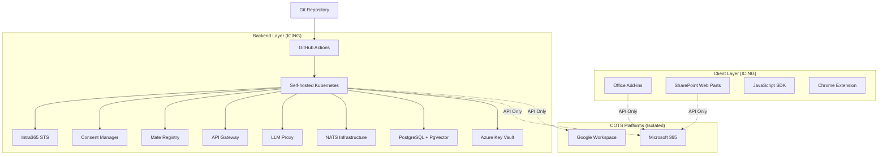

# Overview

Welcome to **Intra365** - a reference architecture for an enterprise intranet system built on the **ICING** (Intranet Connectivity, Integration & Governance) framework that integrates all other systems to form a natural digital workspace.

## What is Intra365?

Intra365 is a reference architecture demonstrating how to implement the ICING framework for enterprise integration. It shows how to connect, extend, and govern digital workplace components across platforms while maintaining complete isolation from commercial off-the-shelf (COTS) products.

## What is ICING?

**ICING** (Intranet Connectivity, Integration & Governance) is an integration framework designed around a core principle:

> *Isolate custom logic and integrations outside of COTS systems to ensure portability, reusability, and long-term maintainability across platforms and migrations.*

This means your custom business logic, workflows, and integrations remain independent of vendor-specific platforms, enabling seamless migrations between Microsoft 365, Google Workspace, or hybrid environments without rewriting core functionality.

## Purpose

This reference architecture demonstrates:

- **GitOps-driven deployments**[^1]: Infrastructure and application state managed declaratively through Git
- **Service orchestration**: Coordinates deployment of all Intra365 Mates (microservices)
- **Configuration management**: Centralized configuration and secrets management via Azure Key Vault CSI[^2]
- **Multi-environment support**: Seamless deployments across development, staging, and production environments
- **Convention over configuration**[^3]: Standardized deployment patterns that reduce boilerplate
- **Prompt-based configuration**: Adaptable platform setup using AI-assisted prompts instead of rigid IaC
- **COTS Isolation**: Complete separation of custom logic from vendor platforms

[^1]: GitOps principles define infrastructure and application configuration as code stored in Git repositories, enabling declarative, version-controlled deployments. See [GitOps Principles](https://www.gitops.tech/).

[^2]: Azure Key Vault provides secure storage for secrets, keys, and certificates with built-in access policies and audit logging. The CSI driver enables Kubernetes pods to mount secrets as volumes. See [Azure Key Vault Documentation](https://learn.microsoft.com/en-us/azure/key-vault/).

[^3]: Convention over configuration is a software design paradigm that reduces the number of decisions developers need to make by providing sensible defaults. See [The Twelve-Factor App](https://12factor.net/).

## Key Features

### 🧩 ICING Framework
Built on connectivity, integration, and governance principles with complete COTS isolation for maximum portability.

### 🔄 GitOps Workflow
All deployments are triggered by Git commits, ensuring version control, auditability, and rollback capabilities.[^4]

### 🚀 Automated Deployments
GitHub Actions workflows automatically deploy services when changes are merged to main branches.

### 🔒 Zero-Trust Security
Integration with Azure Key Vault, network policies, and RAISE 2.0 DevSecOps compliance.[^5]

### 📊 Observability
Built-in monitoring, logging, and tracing for all deployed services.

### 🎯 Service Discovery
Automatic service registration and discovery through NATS messaging infrastructure.[^6]

[^4]: GitOps workflow patterns use Git as the single source of truth for declarative infrastructure and applications, with automated synchronization processes. See [GitOps Working Group](https://www.gitops.tech/).

[^5]: Zero-trust architecture assumes no implicit trust and requires verification of every access request. NIST SP 800-207 provides comprehensive guidance. See [NIST Zero Trust Architecture](https://www.nist.gov/publications/zero-trust-architecture).

[^6]: NATS is a cloud-native messaging system that provides publish-subscribe, request-reply, and queue group patterns for distributed systems. See [NATS.io Documentation](https://docs.nats.io/).

## Architecture at a Glance

## Who Should Use This Documentation?

This documentation is designed for:

- **DevOps Engineers**: Setting up and maintaining infrastructure
- **Developers**: Deploying and configuring Intra365 services
- **Platform Engineers**: Architecting multi-environment deployments
- **Security Engineers**: Implementing compliance and security controls
- **Operations Teams**: Monitoring, troubleshooting, and incident response
- **Enterprise Architects**: Designing vendor-agnostic integration strategies

## Getting Started

Ready to dive in? Start with:

1. [Key Concepts](./02-key-concepts.md) - Understanding ICING and GitOps
2. [Quick Start](./03-quick-start.md) - Deploy your first service in 5 minutes
3. [Architecture Overview](./04-architecture-overview.md) - High-level system design
4. [System Architecture](../020-architecture/01-system-architecture.md) - Deep dive into ICING layers

## Documentation Structure

Our documentation follows a **numeric-prefixed structure** for logical navigation:

- **010-Introduction**: Getting started and core concepts
- **020-Architecture**: System design and ICING patterns
- **030-Infrastructure**: Platform setup and configuration
- **040-Deployment Workflows**: Deployment processes
- **050-Service Configurations**: Service-specific guides
- **060-Security & Compliance**: Security implementation
- **070-Operations Runbooks**: Day-to-day operations
- **080-Troubleshooting**: Common issues and debugging
- **090-Reference**: API, CLI, and configuration reference
- **100-Contributing**: Contribution guidelines
- **110-Roadmap**: Future plans and evolution

## Need Help?

- **GitHub Issues**: [Report bugs or request features](https://github.com/intra365/chef/issues)
- **GitHub Discussions**: [Ask questions and share ideas](https://github.com/intra365/chef/discussions)
- **Intra365 Specs**: [Review full specifications](https://github.com/happy-mates/happy-mates-intra365)

---

## References

- [GitOps Principles](https://www.gitops.tech/) - GitOps Working Group
- [The Twelve-Factor App](https://12factor.net/) - Heroku Dev Center
- [Kubernetes Documentation](https://kubernetes.io/docs/home/) - CNCF
- [Azure Kubernetes Service (AKS)](https://learn.microsoft.com/en-us/azure/aks/) - Microsoft Learn
- [GitHub Actions Documentation](https://docs.github.com/en/actions) - GitHub Docs
- [NIST Zero Trust Architecture](https://www.nist.gov/publications/zero-trust-architecture) - NIST SP 800-207
- [Service Mesh Patterns](https://www.nginx.com/learn/service-mesh/) - NGINX
- [ISO/IEC 27001:2022](https://www.iso.org/standard/27001) - International Organization for Standardization

---

**Ready to orchestrate?** Let's get started with [Key Concepts](./02-key-concepts.md)!
