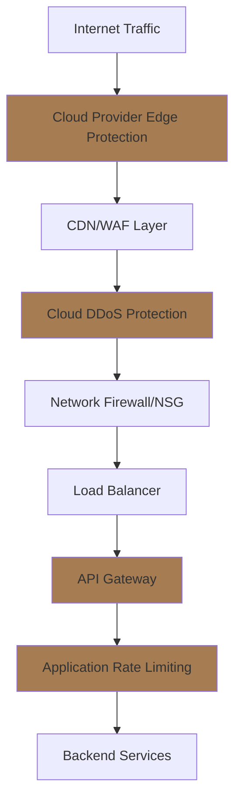

# DDoS Protection

## Overview

This document provides comprehensive guidance on protecting the Intra365 platform against Distributed Denial of Service (DDoS) attacks, including both self-hosted and cloud-based protection strategies.

## Purpose

DDoS protection ensures:

- **Service Availability**: Maintain platform uptime during attack scenarios
- **Business Continuity**: Protect critical business operations from disruption
- **Cost Management**: Prevent resource exhaustion and unexpected scaling costs
- **Reputation Protection**: Maintain service reliability and customer trust
- **Regulatory Compliance**: Meet availability requirements (SOC 2, ISO 27001)

## Related Documents

- [Network Security](../060-security-compliance/020-iso27001-compliance/89-networks-security.md)
- [Network Access Control Model](../060-security-compliance/020-iso27001-compliance/124-network-access-control-model.md)
- [Disaster Recovery](./06-disaster-recovery.md)
- [Scaling Strategy](./07-scaling-strategy.md)
- [Observability](./05-observability.md)

---

## Understanding DDoS Attacks

### Types of DDoS Attacks

| Attack Type | Layer | Description | Impact | Typical Size |
|------------|-------|-------------|--------|--------------|
| **Volumetric** | L3/L4 | Consumes bandwidth (UDP/ICMP floods) | Network saturation | 100+ Gbps |
| **Protocol** | L3/L4 | Exhausts server resources (SYN floods) | Connection exhaustion | 50-100k pps |
| **Application** | L7 | Targets web application (HTTP floods) | Application overload | 10-50k requests/sec |
| **Multi-Vector** | All | Combination of attack types | Comprehensive disruption | Varies |
| **Reflection** | L3/L4 | Amplifies traffic via third parties | Massive bandwidth | 500+ Gbps |
| **Slowloris** | L7 | Slow HTTP requests to exhaust connections | Connection exhaustion | Low bandwidth |

### Attack Indicators

**Network Level**:

- Sudden traffic spikes (10x-100x normal)
- Traffic from unusual geographic locations
- Single source IP or distributed sources
- Abnormal protocol distribution

**Application Level**:

- Increased CPU/memory usage
- High connection counts
- Slow response times
- Database connection pool exhaustion
- Cache bypass patterns

---

## Multi-Layered Defense Strategy

### Defense in Depth Model



---

## Cloud Vendor DDoS Protection

### 1. Microsoft Azure DDoS Protection

#### Azure DDoS Protection Standard

**Features**:

- Always-on traffic monitoring
- Automatic attack mitigation
- Adaptive tuning based on application traffic patterns
- DDoS rapid response support
- Cost protection during attacks
- Native integration with Azure services

**Implementation**:

```hcl
# Terraform - Azure DDoS Protection Plan
resource "azurerm_network_ddos_protection_plan" "main" {
  name                = "intra365-ddos-protection"
  location            = azurerm_resource_group.main.location
  resource_group_name = azurerm_resource_group.main.name

  tags = {
    Environment = "Production"
    Purpose     = "DDoS Protection"
  }
}

# Virtual Network with DDoS Protection
resource "azurerm_virtual_network" "main" {
  name                = "intra365-vnet"
  location            = azurerm_resource_group.main.location
  resource_group_name = azurerm_resource_group.main.name
  address_space       = ["10.0.0.0/16"]

  ddos_protection_plan {
    id     = azurerm_network_ddos_protection_plan.main.id
    enable = true
  }

  tags = {
    Environment = "Production"
  }
}

# Public IP with DDoS Protection
resource "azurerm_public_ip" "main" {
  name                = "intra365-public-ip"
  location            = azurerm_resource_group.main.location
  resource_group_name = azurerm_resource_group.main.name
  allocation_method   = "Static"
  sku                 = "Standard"

  ddos_protection_mode    = "VirtualNetworkInherited"
  ddos_protection_plan_id = azurerm_network_ddos_protection_plan.main.id

  tags = {
    Environment = "Production"
  }
}
```

**Azure Front Door with WAF**:

```hcl
# Azure Front Door for DDoS Protection + WAF
resource "azurerm_frontdoor" "main" {
  name                = "intra365-frontdoor"
  resource_group_name = azurerm_resource_group.main.name

  backend_pool {
    name = "intra365-backend"
    backend {
      host_header = "api.intra365.com"
      address     = "api.intra365.com"
      http_port   = 80
      https_port  = 443
    }

    load_balancing_name = "loadBalancingSettings"
    health_probe_name   = "healthProbeSettings"
  }

  backend_pool_load_balancing {
    name = "loadBalancingSettings"
  }

  backend_pool_health_probe {
    name                = "healthProbeSettings"
    protocol            = "Https"
    interval_in_seconds = 30
  }

  frontend_endpoint {
    name      = "intra365-frontend"
    host_name = "intra365.azurefd.net"
  }

  routing_rule {
    name               = "routingRule"
    accepted_protocols = ["Https"]
    patterns_to_match  = ["/*"]
    frontend_endpoints = ["intra365-frontend"]
    
    forwarding_configuration {
      forwarding_protocol = "HttpsOnly"
      backend_pool_name   = "intra365-backend"
    }
  }
}

# WAF Policy for Front Door
resource "azurerm_frontdoor_firewall_policy" "main" {
  name                              = "intra365wafpolicy"
  resource_group_name               = azurerm_resource_group.main.name
  enabled                           = true
  mode                              = "Prevention"
  custom_block_response_status_code = 403

  managed_rule {
    type    = "Microsoft_DefaultRuleSet"
    version = "2.1"
  }

  managed_rule {
    type    = "Microsoft_BotManagerRuleSet"
    version = "1.0"
  }

  custom_rule {
    name                           = "RateLimitRule"
    enabled                        = true
    priority                       = 100
    rate_limit_duration_in_minutes = 1
    rate_limit_threshold           = 100
    type                           = "RateLimitRule"
    action                         = "Block"

    match_condition {
      match_variable     = "RequestUri"
      operator           = "Contains"
      match_values       = ["/api/"]
      transforms         = ["Lowercase"]
    }
  }
}
```

**Pricing**:

- DDoS Protection Standard: ~$2,944/month per protected resource
- Azure Front Door: Pay-per-use (~$0.25/GB outbound + requests)
- Cost protection: Microsoft covers scaling costs during attacks

**Best For**: Azure-native deployments, enterprise applications requiring 24/7 support

---

### 2. Google Cloud Armor

**Features**:

- Built-in DDoS protection at Google's edge
- L7 filtering with WAF rules
- Adaptive Protection (ML-based)
- Rate limiting and bot management
- Global anycast load balancing

**Implementation**:

```hcl
# Terraform - Google Cloud Armor Security Policy
resource "google_compute_security_policy" "ddos_protection" {
  name        = "intra365-ddos-protection"
  description = "DDoS protection policy with rate limiting"

  # Default rule
  rule {
    action   = "allow"
    priority = "2147483647"
    match {
      versioned_expr = "SRC_IPS_V1"
      config {
        src_ip_ranges = ["*"]
      }
    }
    description = "Default rule, higher priority overrides it"
  }

  # Rate limiting rule
  rule {
    action   = "rate_based_ban"
    priority = "1000"
    match {
      versioned_expr = "SRC_IPS_V1"
      config {
        src_ip_ranges = ["*"]
      }
    }
    rate_limit_options {
      conform_action = "allow"
      exceed_action  = "deny(429)"
      enforce_on_key = "IP"
      
      rate_limit_threshold {
        count        = 100
        interval_sec = 60
      }
      
      ban_duration_sec = 600
    }
    description = "Rate limit: 100 requests per minute per IP"
  }

  # Block known bad IP ranges
  rule {
    action   = "deny(403)"
    priority = "100"
    match {
      versioned_expr = "SRC_IPS_V1"
      config {
        src_ip_ranges = [
          "192.0.2.0/24",  # Example bad IP range
        ]
      }
    }
    description = "Block known malicious IPs"
  }

  # Adaptive Protection (ML-based DDoS detection)
  adaptive_protection_config {
    layer_7_ddos_defense_config {
      enable = true
    }
  }
}

# Attach to backend service
resource "google_compute_backend_service" "api" {
  name                  = "intra365-api-backend"
  protocol              = "HTTP"
  timeout_sec           = 30
  security_policy       = google_compute_security_policy.ddos_protection.id
  load_balancing_scheme = "EXTERNAL_MANAGED"

  backend {
    group = google_compute_instance_group.api.id
  }

  health_checks = [google_compute_health_check.api.id]
}
```

**Pricing**:

- Standard DDoS Protection: Included with Cloud Load Balancing
- Cloud Armor: $7/policy/month + $1.20/million requests
- Advanced DDoS Protection: Additional $3,000/month

**Best For**: GCP deployments, ML-based adaptive protection, global applications

---

### 3. AWS Shield

#### AWS Shield Standard (Free)

**Features**:

- Automatic protection against common attacks
- Always-on detection and mitigation
- Protects ELB, CloudFront, Route 53

#### AWS Shield Advanced ($3,000/month)

**Features**:

- Advanced attack detection and mitigation
- 24/7 DDoS Response Team (DRT) access
- Cost protection (credits for scaling)
- Enhanced metrics and reporting
- Integration with AWS WAF at no cost

**Implementation**:

```hcl
# Terraform - AWS Shield Advanced Protection
resource "aws_shield_protection" "alb" {
  name         = "intra365-alb-protection"
  resource_arn = aws_lb.main.arn

  tags = {
    Environment = "Production"
  }
}

# CloudFront Distribution with Shield
resource "aws_cloudfront_distribution" "main" {
  origin {
    domain_name = "api.intra365.com"
    origin_id   = "intra365-api"

    custom_origin_config {
      http_port              = 80
      https_port             = 443
      origin_protocol_policy = "https-only"
      origin_ssl_protocols   = ["TLSv1.2"]
    }
  }

  enabled             = true
  is_ipv6_enabled     = true
  web_acl_id          = aws_wafv2_web_acl.main.arn

  default_cache_behavior {
    allowed_methods  = ["GET", "HEAD", "OPTIONS", "PUT", "POST", "PATCH", "DELETE"]
    cached_methods   = ["GET", "HEAD"]
    target_origin_id = "intra365-api"

    forwarded_values {
      query_string = true
      cookies {
        forward = "all"
      }
    }

    viewer_protocol_policy = "redirect-to-https"
    min_ttl                = 0
    default_ttl            = 3600
    max_ttl                = 86400
  }

  restrictions {
    geo_restriction {
      restriction_type = "none"
    }
  }

  viewer_certificate {
    acm_certificate_arn = aws_acm_certificate.main.arn
    ssl_support_method  = "sni-only"
  }
}

# AWS WAF Web ACL
resource "aws_wafv2_web_acl" "main" {
  name  = "intra365-ddos-protection"
  scope = "CLOUDFRONT"

  default_action {
    allow {}
  }

  # Rate limiting rule
  rule {
    name     = "RateLimitRule"
    priority = 1

    action {
      block {}
    }

    statement {
      rate_based_statement {
        limit              = 2000
        aggregate_key_type = "IP"
      }
    }

    visibility_config {
      cloudwatch_metrics_enabled = true
      metric_name                = "RateLimitRule"
      sampled_requests_enabled   = true
    }
  }

  # AWS Managed Rules
  rule {
    name     = "AWSManagedRulesCommonRuleSet"
    priority = 2

    override_action {
      none {}
    }

    statement {
      managed_rule_group_statement {
        name        = "AWSManagedRulesCommonRuleSet"
        vendor_name = "AWS"
      }
    }

    visibility_config {
      cloudwatch_metrics_enabled = true
      metric_name                = "AWSManagedRulesCommonRuleSet"
      sampled_requests_enabled   = true
    }
  }

  visibility_config {
    cloudwatch_metrics_enabled = true
    metric_name                = "intra365WebACL"
    sampled_requests_enabled   = true
  }
}
```

**Pricing**:

- Shield Standard: Free
- Shield Advanced: $3,000/month + data transfer fees
- WAF: $5/month per rule + $1/million requests

**Best For**: AWS deployments, applications requiring DRT support, cost-sensitive workloads

---

### 4. Cloudflare DDoS Protection

**Features**:

- World's largest edge network (330+ cities)
- Unmetered DDoS mitigation (included)
- Magic Transit for network-layer protection
- Spectrum for TCP/UDP applications
- Advanced bot management

**Implementation**:

```javascript
// Cloudflare API - Create Firewall Rule
const createCloudflareRule = async () => {
  const zoneId = 'your_zone_id';
  const apiToken = 'your_api_token';

  // Rate limiting rule
  const rateLimitRule = {
    mode: 'challenge',
    period: 60,
    requests_per_period: 100,
    match: {
      request: {
        url: 'api.intra365.com/*'
      }
    },
    action: {
      mode: 'ban',
      timeout: 600
    }
  };

  const response = await fetch(
    `https://api.cloudflare.com/client/v4/zones/${zoneId}/rate_limits`,
    {
      method: 'POST',
      headers: {
        'Authorization': `Bearer ${apiToken}`,
        'Content-Type': 'application/json'
      },
      body: JSON.stringify(rateLimitRule)
    }
  );

  return response.json();
};

// Terraform - Cloudflare Configuration
```

```hcl
# Terraform - Cloudflare Configuration
resource "cloudflare_zone" "main" {
  zone = "intra365.com"
  plan = "business" # or "enterprise"
}

# DDoS Protection Settings (always-on)
resource "cloudflare_zone_settings_override" "security" {
  zone_id = cloudflare_zone.main.id

  settings {
    # Security level (under_attack mode during attacks)
    security_level = "high"
    
    # Browser Integrity Check
    browser_check = "on"
    
    # Challenge passage (bot protection)
    challenge_ttl = 1800
    
    # SSL mode
    ssl = "strict"
    
    # Always Use HTTPS
    always_use_https = "on"
  }
}

# Rate Limiting Rule
resource "cloudflare_rate_limit" "api" {
  zone_id = cloudflare_zone.main.id
  
  threshold = 100
  period    = 60
  
  match {
    request {
      url_pattern = "api.intra365.com/api/*"
    }
  }
  
  action {
    mode    = "ban"
    timeout = 600
  }
  
  description = "Rate limit API endpoints"
}

# Firewall Rule - Block known bad actors
resource "cloudflare_firewall_rule" "block_threats" {
  zone_id     = cloudflare_zone.main.id
  description = "Block known threats"
  filter_id   = cloudflare_filter.threats.id
  action      = "block"
}

resource "cloudflare_filter" "threats" {
  zone_id     = cloudflare_zone.main.id
  description = "Known threat IPs and bots"
  expression  = "(cf.threat_score gt 14) or (cf.bot_management.score lt 30)"
}

# WAF Managed Rules
resource "cloudflare_ruleset" "waf" {
  zone_id     = cloudflare_zone.main.id
  name        = "WAF Rules"
  description = "Managed WAF rules for DDoS protection"
  kind        = "zone"
  phase       = "http_request_firewall_managed"

  rules {
    action = "execute"
    action_parameters {
      id = "efb7b8c949ac4650a09736fc376e9aee" # OWASP Core Ruleset
    }
    expression = "true"
    enabled    = true
  }
}
```

**Pricing**:

- Free Plan: Basic DDoS protection
- Pro ($25/month): Enhanced DDoS + WAF
- Business ($250/month): Advanced DDoS + custom rules
- Enterprise (Custom): Dedicated DDoS + Magic Transit

**Best For**: Multi-cloud deployments, cost-effective protection, fast time-to-value

---

### 5. Comparison Matrix

| Feature | Azure | Google Cloud | AWS | Cloudflare |
|---------|-------|--------------|-----|------------|
| **Always-On Protection** | ✓ | ✓ | ✓ | ✓ |
| **Network-Layer (L3/L4)** | ✓ Strong | ✓ Strong | ✓ Shield Adv | ✓ Magic Transit |
| **Application-Layer (L7)** | ✓ Front Door | ✓ Cloud Armor | ✓ WAF | ✓ Excellent |
| **Automatic Mitigation** | ✓ | ✓ | ✓ | ✓ |
| **Global Edge Network** | Limited | Strong | Strong | ✓ Largest |
| **ML-Based Detection** | Limited | ✓ Adaptive | Limited | ✓ Bot Mgmt |
| **Cost Protection** | ✓ | Limited | ✓ Shield Adv | ✓ Unmetered |
| **24/7 Support** | ✓ Rapid Response | Premium | ✓ DRT | ✓ Enterprise |
| **Min Monthly Cost** | $2,944 | $7 + load balancer | Free/$3,000 | Free/$25 |
| **Best Use Case** | Azure-native | GCP-native, ML | AWS-native | Multi-cloud, CDN |

---

## Self-Hosted DDoS Protection

### 1. NGINX with Rate Limiting

**Basic Rate Limiting**:

```nginx
# /etc/nginx/nginx.conf
http {
    # Define rate limit zone (10MB = ~160k IP addresses)
    limit_req_zone $binary_remote_addr zone=api_limit:10m rate=10r/s;
    limit_req_zone $binary_remote_addr zone=general:10m rate=100r/s;
    
    # Connection limit
    limit_conn_zone $binary_remote_addr zone=conn_limit:10m;
    
    # Geographic blocking (requires ngx_http_geoip_module)
    geoip_country /usr/share/GeoIP/GeoIP.dat;
    map $geoip_country_code $allowed_country {
        default yes;
        CN no;  # Block China (example)
        RU no;  # Block Russia (example)
    }

    server {
        listen 443 ssl http2;
        server_name api.intra365.com;

        # Apply rate limits
        limit_req zone=api_limit burst=20 nodelay;
        limit_conn conn_limit 10;

        # Block if not allowed country
        if ($allowed_country = no) {
            return 403;
        }

        # Block common attack patterns
        if ($request_method !~ ^(GET|POST|PUT|DELETE|HEAD|OPTIONS)$) {
            return 405;
        }

        # SYN flood protection
        client_body_timeout 10s;
        client_header_timeout 10s;
        keepalive_timeout 5s 5s;
        send_timeout 10s;

        location /api/ {
            # Stricter limits for API
            limit_req zone=api_limit burst=5 nodelay;
            
            # Rate limit by API key
            limit_req_zone $http_x_api_key zone=api_key_limit:10m rate=100r/m;
            limit_req zone=api_key_limit burst=10;
            
            proxy_pass http://backend;
        }
    }
}
```

**Advanced Protection with ModSecurity**:

```nginx
# Install ModSecurity
# apt-get install libmodsecurity3 modsecurity-nginx

# /etc/nginx/modsecurity.conf
SecRuleEngine On
SecRequestBodyAccess On
SecResponseBodyAccess Off

# OWASP Core Rule Set
Include /etc/nginx/owasp-modsecurity-crs/crs-setup.conf
Include /etc/nginx/owasp-modsecurity-crs/rules/*.conf

# Custom DDoS protection rules
SecRule REQUEST_HEADERS:User-Agent "^$" \
    "id:1001,phase:1,deny,status:403,msg:'Empty User Agent'"

SecRule REQUEST_LINE "@streq GET HTTP/1.0" \
    "id:1002,phase:1,deny,status:403,msg:'HTTP/1.0 not allowed'"

# Rate limiting via ModSecurity
SecAction "id:900100,phase:1,t:none,pass,\
    initcol:ip=%{REMOTE_ADDR},\
    setvar:ip.requests=+1,\
    expirevar:ip.requests=60"

SecRule IP:REQUESTS "@gt 100" \
    "id:900101,phase:1,deny,status:429,\
    msg:'Rate limit exceeded: %{ip.requests} requests in 60 seconds'"
```

---

### 2. HAProxy with DDoS Protection

```haproxy
# /etc/haproxy/haproxy.cfg
global
    log /dev/log local0
    maxconn 50000
    tune.ssl.default-dh-param 2048

defaults
    log global
    mode http
    option httplog
    option dontlognull
    timeout connect 5s
    timeout client  30s
    timeout server  30s
    timeout http-request 10s
    timeout http-keep-alive 2s

frontend http-in
    bind *:80
    bind *:443 ssl crt /etc/ssl/certs/intra365.pem
    
    # DDoS protection via stick tables
    stick-table type ip size 1m expire 30s store conn_cur,http_req_rate(10s)
    
    # Track connection rate
    tcp-request connection track-sc0 src
    
    # Reject if too many connections from same IP
    tcp-request connection reject if { src_conn_cur ge 10 }
    
    # HTTP request rate limiting
    http-request track-sc1 src
    http-request deny deny_status 429 if { sc1_http_req_rate gt 100 }
    
    # SYN flood protection
    tcp-request inspect-delay 5s
    tcp-request content accept if HTTP
    
    # Block empty user agents
    http-request deny if { req.hdr(user-agent) -m len 0 }
    
    # Block common attack patterns
    acl is_attack path_beg -i /admin /phpmyadmin /.env /wp-admin
    http-request deny if is_attack
    
    # Geographic blocking (requires GeoIP)
    acl is_blocked_country src_is_country CN RU
    http-request deny if is_blocked_country
    
    default_backend app-backend

backend app-backend
    balance roundrobin
    option httpchk GET /health
    
    # Backend server protection
    server app1 10.0.1.10:8080 check maxconn 1000
    server app2 10.0.1.11:8080 check maxconn 1000
```

---

### 3. iptables/nftables (Kernel-Level Protection)

```bash
#!/bin/bash
# /etc/iptables-ddos-protection.sh

# Flush existing rules
iptables -F
iptables -X

# Default policies
iptables -P INPUT DROP
iptables -P FORWARD DROP
iptables -P OUTPUT ACCEPT

# Allow loopback
iptables -A INPUT -i lo -j ACCEPT

# Allow established connections
iptables -A INPUT -m conntrack --ctstate ESTABLISHED,RELATED -j ACCEPT

# SYN flood protection
iptables -A INPUT -p tcp --syn -m limit --limit 1/s --limit-burst 3 -j ACCEPT
iptables -A INPUT -p tcp --syn -j DROP

# Limit ICMP (ping flood)
iptables -A INPUT -p icmp --icmp-type echo-request -m limit --limit 1/s -j ACCEPT
iptables -A INPUT -p icmp --icmp-type echo-request -j DROP

# UDP flood protection
iptables -A INPUT -p udp -m limit --limit 10/s --limit-burst 20 -j ACCEPT
iptables -A INPUT -p udp -j DROP

# Connection tracking limits
iptables -A INPUT -p tcp -m conntrack --ctstate NEW -m limit --limit 60/s --limit-burst 20 -j ACCEPT
iptables -A INPUT -p tcp -m conntrack --ctstate NEW -j DROP

# Port scan detection
iptables -N port-scan
iptables -A port-scan -p tcp --tcp-flags SYN,ACK,FIN,RST RST -m limit --limit 1/s -j RETURN
iptables -A port-scan -j DROP

# Allow HTTP/HTTPS
iptables -A INPUT -p tcp --dport 80 -j ACCEPT
iptables -A INPUT -p tcp --dport 443 -j ACCEPT

# Allow SSH (with rate limiting)
iptables -A INPUT -p tcp --dport 22 -m conntrack --ctstate NEW -m recent --set
iptables -A INPUT -p tcp --dport 22 -m conntrack --ctstate NEW -m recent --update --seconds 60 --hitcount 4 -j DROP
iptables -A INPUT -p tcp --dport 22 -j ACCEPT

# Log and drop everything else
iptables -A INPUT -m limit --limit 5/min -j LOG --log-prefix "iptables denied: " --log-level 7
iptables -A INPUT -j DROP

# Save rules
iptables-save > /etc/iptables/rules.v4
```

**Modern nftables approach**:

```bash
# /etc/nftables.conf
#!/usr/sbin/nft -f

flush ruleset

table inet filter {
    # Rate limiting for DDoS protection
    set rate_limit {
        type ipv4_addr
        size 65536
        flags dynamic,timeout
        timeout 60s
    }

    chain input {
        type filter hook input priority 0; policy drop;

        # Accept loopback
        iif lo accept

        # Accept established connections
        ct state established,related accept

        # Rate limit new connections per IP
        ct state new add @rate_limit { ip saddr limit rate over 10/second } drop

        # SYN flood protection
        tcp flags syn tcp option maxseg size 1-500 drop
        tcp flags syn limit rate over 1/second burst 3 packets drop

        # Allow HTTP/HTTPS
        tcp dport { 80, 443 } accept

        # Allow SSH with rate limiting
        tcp dport 22 ct state new limit rate over 4/minute drop
        tcp dport 22 accept

        # Log drops
        limit rate 5/minute log prefix "nftables drop: "
        drop
    }
}
```

---

### 4. Fail2Ban for Automated Blocking

```ini
# /etc/fail2ban/jail.d/ddos-protection.conf
[nginx-ddos]
enabled = true
port = http,https
filter = nginx-ddos
logpath = /var/log/nginx/access.log
maxretry = 100
findtime = 60
bantime = 600
action = iptables-multiport[name=nginx-ddos, port="http,https", protocol=tcp]

[nginx-http-flood]
enabled = true
port = http,https
filter = nginx-http-flood
logpath = /var/log/nginx/access.log
maxretry = 300
findtime = 60
bantime = 3600
action = iptables-multiport[name=http-flood, port="http,https", protocol=tcp]
```

```conf
# /etc/fail2ban/filter.d/nginx-ddos.conf
[Definition]
failregex = ^<HOST> -.*"(GET|POST|HEAD).*HTTP.*"
ignoreregex =
```

```conf
# /etc/fail2ban/filter.d/nginx-http-flood.conf
[Definition]
failregex = ^<HOST> -.*"(GET|POST).*HTTP.*" (4..|5..)
ignoreregex =
```

---

## Kubernetes DDoS Protection

### 1. NGINX Ingress Controller with Rate Limiting

```yaml
# Ingress with rate limiting annotations
apiVersion: networking.k8s.io/v1
kind: Ingress
metadata:
  name: intra365-api-ingress
  namespace: production
  annotations:
    # Rate limiting
    nginx.ingress.kubernetes.io/limit-rps: "10"
    nginx.ingress.kubernetes.io/limit-rpm: "100"
    nginx.ingress.kubernetes.io/limit-connections: "10"
    nginx.ingress.kubernetes.io/limit-burst-multiplier: "5"
    
    # Request size limits
    nginx.ingress.kubernetes.io/proxy-body-size: "10m"
    
    # Timeouts for slowloris protection
    nginx.ingress.kubernetes.io/proxy-connect-timeout: "5"
    nginx.ingress.kubernetes.io/proxy-send-timeout: "30"
    nginx.ingress.kubernetes.io/proxy-read-timeout: "30"
    
    # Enable ModSecurity WAF
    nginx.ingress.kubernetes.io/enable-modsecurity: "true"
    nginx.ingress.kubernetes.io/enable-owasp-core-rules: "true"
    
    # Custom ModSecurity snippet
    nginx.ingress.kubernetes.io/modsecurity-snippet: |
      SecRuleEngine On
      SecRule REQUEST_HEADERS:User-Agent "^$" "id:1001,phase:1,deny,status:403"
spec:
  ingressClassName: nginx
  rules:
  - host: api.intra365.com
    http:
      paths:
      - path: /
        pathType: Prefix
        backend:
          service:
            name: api-service
            port:
              number: 80
  tls:
  - hosts:
    - api.intra365.com
    secretName: api-tls-secret
```

### 2. Istio Service Mesh Rate Limiting

```yaml
# EnvoyFilter for rate limiting at the edge
apiVersion: networking.istio.io/v1alpha3
kind: EnvoyFilter
metadata:
  name: rate-limit-filter
  namespace: istio-system
spec:
  workloadSelector:
    labels:
      istio: ingressgateway
  configPatches:
  - applyTo: HTTP_FILTER
    match:
      context: GATEWAY
      listener:
        filterChain:
          filter:
            name: "envoy.filters.network.http_connection_manager"
    patch:
      operation: INSERT_BEFORE
      value:
        name: envoy.filters.http.ratelimit
        typed_config:
          "@type": type.googleapis.com/envoy.extensions.filters.http.ratelimit.v3.RateLimit
          domain: intra365-ratelimit
          failure_mode_deny: false
          rate_limit_service:
            grpc_service:
              envoy_grpc:
                cluster_name: rate_limit_cluster
            transport_api_version: V3

---
# RequestAuthentication + AuthorizationPolicy
apiVersion: security.istio.io/v1beta1
kind: RequestAuthentication
metadata:
  name: api-jwt-auth
  namespace: production
spec:
  selector:
    matchLabels:
      app: api-service
  jwtRules:
  - issuer: "https://auth.intra365.com"
    jwksUri: "https://auth.intra365.com/.well-known/jwks.json"

---
apiVersion: security.istio.io/v1beta1
kind: AuthorizationPolicy
metadata:
  name: api-rate-limit
  namespace: production
spec:
  selector:
    matchLabels:
      app: api-service
  action: DENY
  rules:
  # Rate limit based on source IP
  - from:
    - source:
        requestPrincipals: ["*"]
    when:
    - key: request.headers[x-ratelimit-exceeded]
      values: ["true"]
```

### 3. Network Policies for DDoS Isolation

```yaml
# NetworkPolicy to restrict traffic
apiVersion: networking.k8s.io/v1
kind: NetworkPolicy
metadata:
  name: ddos-protection-policy
  namespace: production
spec:
  podSelector:
    matchLabels:
      app: api-service
  policyTypes:
  - Ingress
  - Egress
  ingress:
  # Only allow from ingress controller
  - from:
    - namespaceSelector:
        matchLabels:
          name: ingress-nginx
    - podSelector:
        matchLabels:
          app.kubernetes.io/name: ingress-nginx
    ports:
    - protocol: TCP
      port: 8080
  egress:
  # Allow DNS
  - to:
    - namespaceSelector:
        matchLabels:
          name: kube-system
    ports:
    - protocol: UDP
      port: 53
  # Allow database connections
  - to:
    - podSelector:
        matchLabels:
          app: postgresql
    ports:
    - protocol: TCP
      port: 5432
```

---

## Monitoring and Detection

### 1. Prometheus Metrics

```yaml
# ServiceMonitor for DDoS metrics
apiVersion: monitoring.coreos.com/v1
kind: ServiceMonitor
metadata:
  name: ddos-metrics
  namespace: monitoring
spec:
  selector:
    matchLabels:
      app: nginx-ingress
  endpoints:
  - port: metrics
    interval: 10s
```

**PromQL Queries for DDoS Detection**:

```promql
# Request rate spike detection (current vs baseline)
rate(http_requests_total[5m]) > (
  avg_over_time(http_requests_total[1h] offset 1d)[5m:] * 3
)

# High error rate (potential application-layer DDoS)
sum(rate(http_requests_total{status=~"5.."}[5m])) 
/ 
sum(rate(http_requests_total[5m])) > 0.1

# Connection exhaustion
node_netstat_Tcp_CurrEstab > 10000

# Bandwidth spike
rate(node_network_receive_bytes_total[5m]) > 100000000  # 100 MB/s

# Unusual traffic sources
topk(10, count by (source_ip) (http_requests_total[5m]))
```

### 2. Alert Rules

```yaml
# PrometheusRule for DDoS alerts
apiVersion: monitoring.coreos.com/v1
kind: PrometheusRule
metadata:
  name: ddos-alerts
  namespace: monitoring
spec:
  groups:
  - name: ddos_protection
    interval: 30s
    rules:
    - alert: PossibleDDoSAttack
      expr: |
        rate(http_requests_total[5m]) > 
        (avg_over_time(http_requests_total[1h] offset 1d)[5m:] * 5)
      for: 2m
      labels:
        severity: critical
        category: ddos
      annotations:
        summary: "Possible DDoS attack detected"
        description: "Request rate is 5x higher than normal baseline"
    
    - alert: HighConnectionCount
      expr: node_netstat_Tcp_CurrEstab > 50000
      for: 5m
      labels:
        severity: warning
        category: ddos
      annotations:
        summary: "High TCP connection count"
        description: "Current connections: {{ $value }}"
    
    - alert: BandwidthSpike
      expr: |
        rate(node_network_receive_bytes_total[5m]) > 500000000
      for: 2m
      labels:
        severity: critical
        category: ddos
      annotations:
        summary: "Unusual bandwidth spike detected"
        description: "Network receive rate: {{ $value | humanize }}B/s"
    
    - alert: HighErrorRate
      expr: |
        sum(rate(http_requests_total{status=~"5.."}[5m])) 
        / 
        sum(rate(http_requests_total[5m])) > 0.2
      for: 5m
      labels:
        severity: warning
        category: ddos
      annotations:
        summary: "High HTTP 5xx error rate"
        description: "Error rate: {{ $value | humanizePercentage }}"
```

### 3. Grafana Dashboard

```json
{
  "dashboard": {
    "title": "DDoS Protection Monitoring",
    "panels": [
      {
        "title": "Request Rate",
        "targets": [
          {
            "expr": "sum(rate(http_requests_total[5m]))",
            "legendFormat": "Current"
          },
          {
            "expr": "avg_over_time(http_requests_total[1h] offset 1d)[5m:]",
            "legendFormat": "Baseline (24h ago)"
          }
        ]
      },
      {
        "title": "Top Source IPs",
        "targets": [
          {
            "expr": "topk(10, sum by (source_ip) (rate(http_requests_total[5m])))",
            "legendFormat": "{{ source_ip }}"
          }
        ]
      },
      {
        "title": "Error Rate by Status Code",
        "targets": [
          {
            "expr": "sum by (status) (rate(http_requests_total{status=~\"4..|5..\"}[5m]))",
            "legendFormat": "{{ status }}"
          }
        ]
      },
      {
        "title": "Connection States",
        "targets": [
          {
            "expr": "node_netstat_Tcp_CurrEstab",
            "legendFormat": "Established"
          },
          {
            "expr": "node_netstat_Tcp_InSegs",
            "legendFormat": "Inbound Segments"
          }
        ]
      }
    ]
  }
}
```

---

## Incident Response Procedures

### DDoS Incident Response Playbook

#### Phase 1: Detection (0-5 minutes)

1. **Automated Alerts Triggered**
   - Prometheus alerts fire
   - Cloud provider notifications
   - Application monitoring alerts

2. **Initial Assessment**
   ```bash
   # Check current connections
   netstat -an | grep ESTABLISHED | wc -l
   
   # Check top IPs
   netstat -ntu | awk '{print $5}' | cut -d: -f1 | sort | uniq -c | sort -nr | head -20
   
   # Check bandwidth
   iftop -i eth0
   
   # Check request rate
   tail -f /var/log/nginx/access.log | pv -l -r > /dev/null
   ```

3. **Classify Attack Type**
   - Volumetric (bandwidth saturation)
   - Protocol (connection exhaustion)
   - Application (HTTP flood)
   - Multi-vector

#### Phase 2: Immediate Response (5-15 minutes)

1. **Activate DDoS Protection**
   ```bash
   # Enable cloud provider DDoS protection
   # Azure
   az network ddos-protection update \
     --name intra365-ddos \
     --resource-group production \
     --enable true
   
   # Cloudflare - Enable "Under Attack" mode
   curl -X PATCH "https://api.cloudflare.com/client/v4/zones/${ZONE_ID}/settings/security_level" \
     -H "Authorization: Bearer ${API_TOKEN}" \
     -H "Content-Type: application/json" \
     --data '{"value":"under_attack"}'
   ```

2. **Implement Emergency Rate Limiting**
   ```bash
   # Update NGINX config
   cat >> /etc/nginx/conf.d/emergency-rate-limit.conf << EOF
   limit_req_zone \$binary_remote_addr zone=emergency:10m rate=1r/s;
   limit_req zone=emergency burst=5 nodelay;
   EOF
   
   nginx -s reload
   ```

3. **Block Attack Sources**
   ```bash
   # Block top attacking IPs
   awk '{print $1}' /var/log/nginx/access.log | \
     sort | uniq -c | sort -nr | head -100 | \
     awk '$1 > 1000 {print "iptables -A INPUT -s "$2" -j DROP"}' | \
     bash
   ```

4. **Scale Resources** (if application-layer attack)
   ```bash
   # Kubernetes - scale up
   kubectl scale deployment api-service --replicas=20 -n production
   
   # Azure - scale VMSS
   az vmss scale \
     --resource-group production \
     --name api-vmss \
     --new-capacity 10
   ```

#### Phase 3: Mitigation (15-60 minutes)

1. **Analyze Attack Pattern**
   ```bash
   # Analyze access logs
   cat /var/log/nginx/access.log | \
     awk '{print $1, $7, $9}' | \
     sort | uniq -c | sort -nr | head -50
   
   # Geographic distribution
   geoiplookup $(awk '{print $1}' /var/log/nginx/access.log | sort -u)
   ```

2. **Implement Targeted Blocking**
   ```yaml
   # Update Kubernetes NetworkPolicy
   apiVersion: networking.k8s.io/v1
   kind: NetworkPolicy
   metadata:
     name: emergency-ddos-block
     namespace: production
   spec:
     podSelector: {}
     policyTypes:
     - Ingress
     ingress:
     - from:
       - ipBlock:
           cidr: 0.0.0.0/0
           except:
           - 192.0.2.0/24  # Attacker's network
   ```

3. **Engage Support**
   - Cloud provider DDoS Response Team
   - Network ISP (for volumetric attacks)
   - Security incident response team

#### Phase 4: Recovery (1-24 hours)

1. **Monitor Attack Subsiding**
   - Watch metrics return to normal
   - Verify service restoration
   - Check error rates

2. **Gradual Relaxation**
   ```bash
   # Gradually increase rate limits
   # Remove temporary IP blocks
   iptables -D INPUT -s <attacker-ip> -j DROP
   
   # Scale down resources
   kubectl scale deployment api-service --replicas=5 -n production
   ```

3. **Service Verification**
   ```bash
   # Run health checks
   curl -I https://api.intra365.com/health
   
   # Synthetic monitoring
   # Check from multiple locations
   ```

#### Phase 5: Post-Incident (24-72 hours)

1. **Root Cause Analysis**
   - Attack vector analysis
   - Entry point identification
   - Defense effectiveness review

2. **Documentation**
   - Incident timeline
   - Attack characteristics
   - Response actions taken
   - Lessons learned

3. **Improvement Actions**
   - Update firewall rules
   - Enhance monitoring
   - Review rate limits
   - Update runbooks

---

## Recommended Strategy for Intra365

### Hybrid Approach (Best Value)

#### Layer 1: Cloudflare (Edge Protection)

- Cost: $250/month (Business Plan)
- Protection: L7 DDoS, bot management, WAF
- Global CDN with 330+ locations

#### Layer 2: Azure DDoS Protection (Network Layer)

- Cost: Included with Azure services or $2,944/month for Standard
- Protection: L3/L4 DDoS, automatic mitigation
- Native Azure integration

#### Layer 3: Self-Hosted (Application Layer)

- Cost: Infrastructure only
- Protection: NGINX rate limiting, ModSecurity WAF
- Fine-grained control

**Total Monthly Cost**: ~$250-$3,200 depending on Azure tier

### Implementation Roadmap

#### Phase 1: Immediate (Week 1)

- [ ] Enable Cloudflare Business plan
- [ ] Configure basic rate limiting
- [ ] Set up monitoring and alerts
- [ ] Document incident response procedures

#### Phase 2: Foundation (Week 2-4)

- [ ] Deploy Azure DDoS Protection Standard
- [ ] Implement NGINX rate limiting with ModSecurity
- [ ] Configure Kubernetes network policies
- [ ] Set up Prometheus monitoring

#### Phase 3: Enhancement (Month 2)

- [ ] Fine-tune rate limits based on traffic patterns
- [ ] Implement geographic blocking
- [ ] Set up automated response scripts
- [ ] Conduct DDoS simulation testing

#### Phase 4: Optimization (Month 3+)

- [ ] Review and adjust protection based on incidents
- [ ] Optimize costs vs. protection level
- [ ] Regular testing and updates
- [ ] Team training on incident response

---

## Testing and Validation

### 1. Controlled DDoS Testing

**Never test against production without explicit permission from your cloud provider!**

```bash
# Use authorized testing services
# Example: Azure DDoS Testing (requires approval)

# Self-hosted load testing (for rate limit validation)
# Apache Bench
ab -n 10000 -c 100 https://test.intra365.com/api/endpoint

# Hey (modern alternative)
hey -n 10000 -c 100 -q 10 https://test.intra365.com/api/endpoint

# Locust (programmable load testing)
```

```python
# locust_ddos_test.py
from locust import HttpUser, task, between

class DDoSTest(HttpUser):
    wait_time = between(0.1, 0.5)
    
    @task
    def api_endpoint(self):
        self.client.get("/api/data")
    
    @task
    def login_attempt(self):
        self.client.post("/api/auth/login", json={
            "username": "test",
            "password": "test"
        })

# Run: locust -f locust_ddos_test.py --host=https://test.intra365.com
```

### 2. Validation Checklist

- [ ] Rate limits block excessive requests (verify 429 responses)
- [ ] Geographic blocking works (test from blocked countries via VPN)
- [ ] Connection limits prevent exhaustion
- [ ] Alerts trigger correctly
- [ ] Auto-mitigation activates
- [ ] Service remains available under load
- [ ] Backup systems activate if needed
- [ ] Incident response procedures are clear

---

## Cost Analysis

### Monthly Cost Comparison (Medium-sized Application)

| Solution | Setup Cost | Monthly Cost | Attack Protection | Support |
|----------|-----------|--------------|-------------------|---------|
| **Cloudflare Business** | $0 | $250 | Excellent | Email |
| **Azure DDoS Standard** | $0 | $2,944 | Excellent | 24/7 |
| **AWS Shield Advanced** | $0 | $3,000 | Excellent | 24/7 DRT |
| **Google Cloud Armor** | $0 | $7-3,000 | Good-Excellent | Varies |
| **Self-Hosted (NGINX)** | $1,000 | $0 | Good | Internal |
| **Hybrid (CF + Azure Basic)** | $0 | $250 | Excellent | Email |
| **Hybrid (CF + Azure Std)** | $0 | $3,194 | Maximum | 24/7 |

**Recommendation for Intra365**: Start with Cloudflare Business ($250/month) + Azure basic (included), upgrade to Azure DDoS Standard when revenue justifies the cost.

---

## Compliance and Reporting

### ISO 27001 / SOC 2 Requirements

**Documentation Required**:

- DDoS protection policy
- Incident response procedures
- Regular testing records
- Monitoring and alerting configuration
- Vendor SLAs and agreements
- Business continuity plans

**Evidence for Audits**:

- DDoS protection configuration screenshots
- Monitoring dashboard access
- Incident response logs
- Testing results
- Vendor contracts and SLAs

---

## References

- [Azure DDoS Protection Documentation](https://learn.microsoft.com/en-us/azure/ddos-protection/)
- [Google Cloud Armor Best Practices](https://cloud.google.com/armor/docs/best-practices)
- [AWS Shield Advanced Guide](https://docs.aws.amazon.com/waf/latest/developerguide/ddos-advanced.html)
- [Cloudflare DDoS Protection](https://www.cloudflare.com/ddos/)
- [OWASP DDoS Prevention Cheat Sheet](https://cheatsheetseries.owasp.org/cheatsheets/Denial_of_Service_Cheat_Sheet.html)
- [NIST SP 800-61 Rev. 2: Computer Security Incident Handling Guide](https://nvlpubs.nist.gov/nistpubs/SpecialPublications/NIST.SP.800-61r2.pdf)

---

**Document Version**: 1.0  
**Last Updated**: November 13, 2025  
**Next Review Date**: February 13, 2026  
**Owner**: Infrastructure Team / CISO  
**Classification**: Internal Use

---

**Questions or feedback?** [Open an issue](https://github.com/intra365/chef/issues) or [start a discussion](https://github.com/intra365/chef/discussions).
