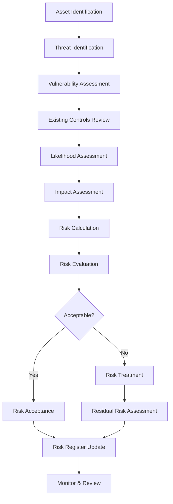

# Risk Assessment Methodology

## Overview

This document defines the risk assessment methodology for the Intra365 platform in accordance with ISO 27001:2022 requirements. The methodology provides a systematic approach to identifying, analyzing, evaluating, and treating information security risks.

## Risk Management Framework

### Objectives

The risk management process aims to:
- Identify threats and vulnerabilities that could impact information assets
- Assess the likelihood and impact of risks materializing
- Determine appropriate risk treatment options
- Monitor and review risks on an ongoing basis
- Support informed decision-making about risk acceptance

### Principles

Risk management at Intra365 follows these principles:
- **Comprehensive**: Covers all information assets and processes
- **Structured**: Systematic and consistent approach
- **Customized**: Tailored to Intra365's context and needs
- **Inclusive**: Involves relevant stakeholders
- **Dynamic**: Adapts to changing threat landscape
- **Transparent**: Clear documentation and communication
- **Evidence-Based**: Uses available information and data

## Risk Assessment Process

## Step 1: Asset Identification

### Asset Categories

Assets are classified into the following categories:

#### Information Assets
- **Databases**: Customer data, configuration data, operational data
- **Documents**: Policies, procedures, contracts, designs
- **Source Code**: Application code, infrastructure as code, scripts
- **Credentials**: Passwords, API keys, certificates, tokens

#### Software Assets
- **Applications**: Intra365 services, third-party applications
- **Operating Systems**: Linux, Windows, container images
- **Development Tools**: IDEs, CI/CD pipelines, version control
- **Security Tools**: SIEM, vulnerability scanners, monitoring systems

#### Physical Assets
- **Hardware**: Servers (if any on-prem), networking equipment
- **Endpoints**: Laptops, mobile devices, workstations
- **Storage Media**: USB drives, backup tapes, external drives

#### Services
- **Cloud Services**: Azure infrastructure, SaaS applications
- **Managed Services**: Monitoring, support, maintenance
- **Network Services**: Internet connectivity, VPN, DNS

#### Human Assets
- **Employees**: Development, operations, management
- **Contractors**: External consultants, temporary staff
- **Partners**: Vendors, service providers

### Asset Valuation

Assets are valued based on their importance to the organization:

| Value Level | Description | Impact if Compromised |
|-------------|-------------|------------------------|
| **Critical** | Essential for business operations | Severe business disruption, major financial loss |
| **High** | Important for business functions | Significant impact on operations or reputation |
| **Medium** | Valuable but not critical | Moderate impact, manageable with workarounds |
| **Low** | Minimal business impact | Minor inconvenience, easily replaceable |

#### Valuation Criteria

Consider the following when valuing assets:
- **Confidentiality**: Sensitivity of information
- **Integrity**: Impact of unauthorized modification
- **Availability**: Criticality of system uptime
- **Legal/Regulatory**: Compliance obligations
- **Reputation**: Brand and customer trust impact
- **Financial**: Direct and indirect costs

### Asset Inventory

Maintain a comprehensive asset inventory including:
- Asset ID and name
- Asset type and category
- Owner and custodian
- Location (physical or logical)
- Classification level
- Dependencies
- Backup and recovery requirements

See [Asset Management](asset-management) for detailed inventory processes.

## Step 2: Threat Identification

### Threat Categories

#### Cyber Threats
- **Malware**: Viruses, ransomware, trojans
- **Hacking**: Unauthorized access, exploitation
- **Social Engineering**: Phishing, pretexting, baiting
- **DDoS**: Denial of service attacks
- **Data Breaches**: Unauthorized data disclosure
- **Insider Threats**: Malicious or negligent insiders

#### Physical Threats
- **Natural Disasters**: Fire, flood, earthquake
- **Environmental**: Power failure, cooling failure
- **Theft**: Physical theft of equipment or media
- **Damage**: Accidental or deliberate damage

#### Organizational Threats
- **Process Failures**: Inadequate procedures
- **Human Error**: Mistakes, misconfigurations
- **Third-Party Failures**: Supplier issues, service outages
- **Management Failures**: Inadequate oversight or resources

#### External Threats
- **Regulatory Changes**: New compliance requirements
- **Market Changes**: Competitive pressures
- **Geopolitical**: Political instability, sanctions

### Threat Sources

| Threat Source | Examples | Motivation |
|---------------|----------|------------|
| **Hostile Attackers** | Hackers, organized crime, nation-states | Financial gain, espionage, disruption |
| **Insiders** | Employees, contractors | Revenge, financial gain, negligence |
| **Competitors** | Business rivals | Competitive advantage |
| **Natural Events** | Weather, geological events | N/A - Acts of nature |
| **System Failures** | Hardware/software defects | N/A - Technical issues |

### Threat Intelligence

Leverage threat intelligence sources:
- **Public Sources**: CERT advisories, vulnerability databases (CVE, NVD)
- **Industry Sources**: ISAC reports, sector-specific intelligence
- **Vendor Sources**: Security bulletins, patch notices
- **Internal Sources**: Incident logs, security monitoring

See [Threat Intelligence](threat-intelligence) for detailed processes.

## Step 3: Vulnerability Assessment

### Vulnerability Types

#### Technical Vulnerabilities
- **Software Vulnerabilities**: Unpatched systems, outdated software
- **Configuration Weaknesses**: Misconfigurations, insecure defaults
- **Network Vulnerabilities**: Unsecured protocols, open ports
- **Cryptographic Weaknesses**: Weak encryption, poor key management

#### Physical Vulnerabilities
- **Access Control Weaknesses**: Inadequate physical security
- **Environmental Weaknesses**: Insufficient environmental controls

#### Organizational Vulnerabilities
- **Policy Gaps**: Missing or inadequate policies
- **Process Weaknesses**: Ineffective procedures
- **Awareness Gaps**: Insufficient training or awareness

#### Human Vulnerabilities
- **Lack of Training**: Insufficient security knowledge
- **Social Engineering Susceptibility**: Lack of awareness
- **Negligence**: Careless handling of information or systems

### Vulnerability Assessment Methods

#### Automated Scanning
- **Vulnerability Scanners**: Regular automated scans (weekly/monthly)
- **Configuration Scanners**: Check for compliance with baselines
- **Code Analysis**: SAST and DAST for application vulnerabilities

#### Manual Assessment
- **Penetration Testing**: Annual or bi-annual pen tests
- **Security Reviews**: Architecture and code reviews
- **Physical Inspections**: Review of physical security controls

#### Third-Party Assessments
- **External Audits**: Independent security assessments
- **Vendor Assessments**: Review of third-party security

## Step 4: Existing Controls Review

Review currently implemented security controls:

### Control Categories
- **Preventive Controls**: Stop incidents before they occur
- **Detective Controls**: Identify incidents that have occurred
- **Corrective Controls**: Fix issues and restore normal operations
- **Deterrent Controls**: Discourage potential attackers

### Control Effectiveness

Rate control effectiveness:
- **Effective**: Control fully addresses the risk
- **Partially Effective**: Control provides some mitigation
- **Ineffective**: Control does not adequately address the risk
- **Not Implemented**: Control is documented but not deployed

## Step 5: Likelihood Assessment

### Likelihood Levels

| Level | Description | Probability | Examples |
|-------|-------------|-------------|----------|
| **Very High** | Almost certain to occur | > 80% | Unpatched critical vulnerability with active exploits |
| **High** | Likely to occur | 60-80% | Known vulnerability, common attack vector |
| **Medium** | Possible to occur | 30-60% | Vulnerability with some barriers to exploitation |
| **Low** | Unlikely to occur | 10-30% | Requires sophisticated attack or rare circumstances |
| **Very Low** | Rare occurrence | < 10% | Requires highly sophisticated attack and perfect conditions |

### Factors Affecting Likelihood

- **Threat Capability**: Attacker skill and resources required
- **Threat Motivation**: Attractiveness of target to attackers
- **Vulnerability Severity**: Ease of exploitation
- **Existing Controls**: Effectiveness of current safeguards
- **Attack Surface**: Exposure of systems and data
- **Historical Data**: Past incidents and trends

## Step 6: Impact Assessment

### Impact Categories

Assess impact across multiple dimensions:

#### Confidentiality Impact
- **Critical**: Exposure of highly sensitive data (customer data, trade secrets)
- **High**: Exposure of sensitive data (internal documents, employee data)
- **Medium**: Exposure of confidential but less sensitive data
- **Low**: Exposure of public or low-sensitivity information

#### Integrity Impact
- **Critical**: Unauthorized modification of critical systems or data
- **High**: Modification affecting business operations or decisions
- **Medium**: Modification with limited business impact
- **Low**: Modification of non-critical data or systems

#### Availability Impact
- **Critical**: Complete loss of critical business services (> 24 hours)
- **High**: Significant service degradation or outage (4-24 hours)
- **Medium**: Moderate service degradation (1-4 hours)
- **Low**: Minor service degradation (< 1 hour)

### Business Impact Categories

| Impact Area | Critical | High | Medium | Low |
|-------------|----------|------|--------|-----|
| **Financial** | > $1M | $100K-$1M | $10K-$100K | < $10K |
| **Reputation** | Major brand damage | Significant negative press | Limited negative press | Minimal impact |
| **Legal/Regulatory** | Major fines, criminal charges | Regulatory sanctions | Compliance warnings | No legal impact |
| **Operations** | Complete business disruption | Major service disruption | Moderate disruption | Minor inconvenience |
| **Customer** | Mass customer loss | Significant churn | Some customer impact | Minimal customer impact |

## Step 7: Risk Calculation

### Risk Matrix

Risk = Likelihood × Impact

| | Very Low Impact | Low Impact | Medium Impact | High Impact | Critical Impact |
|---|---|---|---|---|---|
| **Very High Likelihood** | Medium | High | High | Critical | Critical |
| **High Likelihood** | Low | Medium | High | High | Critical |
| **Medium Likelihood** | Low | Medium | Medium | High | High |
| **Low Likelihood** | Very Low | Low | Medium | Medium | High |
| **Very Low Likelihood** | Very Low | Very Low | Low | Medium | Medium |

### Risk Levels

- **Critical**: Immediate action required, executive notification
- **High**: Prompt action required, prioritize resources
- **Medium**: Action required within defined timeframe
- **Low**: Monitor and review regularly
- **Very Low**: Accept or monitor periodically

## Step 8: Risk Evaluation

### Risk Acceptance Criteria

| Risk Level | Acceptance Authority | Default Action |
|------------|----------------------|----------------|
| **Critical** | Executive Management | Must treat |
| **High** | CISO | Must treat or transfer |
| **Medium** | Department Head | Treat, transfer, or accept with justification |
| **Low** | Asset Owner | Accept or treat if cost-effective |
| **Very Low** | Asset Owner | Accept |

### Decision Factors

Consider when evaluating risks:
- Cost of risk treatment vs. potential impact
- Availability of effective controls
- Regulatory or contractual requirements
- Risk appetite and tolerance
- Business priorities and resources
- Stakeholder expectations

## Risk Treatment

### Treatment Options

#### 1. Risk Mitigation (Most Common)
Implement controls to reduce likelihood or impact:
- Technical controls (firewalls, encryption, MFA)
- Administrative controls (policies, procedures, training)
- Physical controls (access control, environmental protection)

#### 2. Risk Avoidance
Eliminate the risk by not performing the activity:
- Decommission vulnerable systems
- Discontinue risky services or features
- Change business processes

#### 3. Risk Transfer
Share or transfer risk to another party:
- Cyber insurance
- Outsourcing to specialized providers
- Contractual risk transfer to vendors

#### 4. Risk Acceptance
Accept the risk without further action:
- Cost of mitigation exceeds potential impact
- Risk is within acceptable tolerance
- No effective mitigation available
- Must be formally documented and approved

### Risk Treatment Plan

For each risk requiring treatment, document:
- **Risk ID**: Unique identifier
- **Risk Description**: Clear description of the risk
- **Treatment Option**: Mitigation, avoidance, transfer, or acceptance
- **Controls**: Specific controls to be implemented
- **Owner**: Person responsible for implementation
- **Timeline**: Target completion date
- **Resources**: Budget and resources required
- **Success Criteria**: How to verify effectiveness

## Residual Risk Assessment

After implementing risk treatments:

1. **Re-assess Likelihood**: Determine if controls reduce likelihood
2. **Re-assess Impact**: Determine if controls reduce impact
3. **Calculate Residual Risk**: Updated risk = New likelihood × New impact
4. **Evaluate Residual Risk**: Determine if residual risk is acceptable
5. **Document Acceptance**: Obtain approval for residual risk acceptance

### Residual Risk Acceptance

- All residual risks must be formally accepted by appropriate authority
- Document justification for acceptance
- Review residual risks regularly (at least annually)
- Monitor for changes that might increase residual risk

See [Residual Risk Tracking](../010-core-security/09-residual-risk-tracking.md) for tracking processes.

## Risk Register

### Risk Register Contents

Maintain a comprehensive risk register with:
- **Risk ID**: Unique identifier (e.g., RISK-2025-001)
- **Asset**: Affected asset or system
- **Threat**: Identified threat
- **Vulnerability**: Exploitable weakness
- **Existing Controls**: Currently implemented safeguards
- **Likelihood**: Before and after treatment
- **Impact**: Before and after treatment
- **Risk Level**: Before and after treatment (inherent and residual)
- **Treatment Plan**: Planned or implemented actions
- **Owner**: Risk owner and control owner
- **Status**: Open, In Treatment, Closed, Accepted
- **Review Date**: Next scheduled review
- **Notes**: Additional context or observations

### Risk Register Management

- **Regular Updates**: Update register as risks change or new risks emerge
- **Version Control**: Maintain history of risk assessments
- **Access Control**: Limit access to authorized personnel
- **Reporting**: Generate reports for management review
- **Integration**: Link to incident management and vulnerability tracking

## Risk Monitoring and Review

### Continuous Monitoring

- **Security Events**: Monitor SIEM alerts and security logs
- **Vulnerability Scans**: Regular automated scans
- **Threat Intelligence**: Track emerging threats
- **Control Effectiveness**: Verify controls are working
- **KPIs**: Track security metrics and trends

### Periodic Reviews

| Frequency | Activity | Participants |
|-----------|----------|--------------|
| **Monthly** | Risk register review | CISO, Risk Owners |
| **Quarterly** | Comprehensive risk assessment | CISO, Department Heads |
| **Annually** | Full ISMS risk assessment | CISO, Executive Management |
| **Ad-hoc** | Triggered by significant changes | Relevant stakeholders |

### Triggers for Ad-hoc Review

- New significant threats or vulnerabilities
- Major changes to systems or infrastructure
- Security incidents
- Changes in business operations or strategy
- New regulatory requirements
- Failed audits or assessments

## Risk Communication

### Reporting

#### Executive Dashboard
- Summary of critical and high risks
- Trend analysis
- Key risk indicators (KRIs)
- Treatment progress

#### Detailed Reports
- Complete risk register
- Risk treatment plans
- Control implementation status
- Residual risk analysis

### Stakeholder Communication

- **Executive Management**: Strategic risks, major incidents, budget needs
- **Department Heads**: Departmental risks, resource needs
- **Risk Owners**: Specific risks they own, treatment responsibilities
- **All Staff**: General awareness, individual responsibilities

## Tools and Templates

### Risk Assessment Templates
- Asset inventory template
- Threat and vulnerability assessment worksheet
- Risk calculation spreadsheet
- Risk treatment plan template
- Risk acceptance form

### Tools
- **Asset Management**: Inventory and tracking tools
- **Vulnerability Management**: Scanners and tracking systems
- **Risk Management Software**: Risk register and reporting
- **SIEM**: Security monitoring and alerting
- **GRC Platforms**: Integrated governance, risk, and compliance

## Integration with ISMS

### Risk-Based Approach

Risk assessment informs:
- **Control Selection**: Choose controls based on risks (Statement of Applicability)
- **Resource Allocation**: Prioritize investments based on risk levels
- **Policy Development**: Policies address identified risks
- **Training Focus**: Target training to high-risk areas
- **Audit Planning**: Focus audits on high-risk areas

### PDCA Cycle Integration

- **Plan**: Risk assessment informs ISMS planning
- **Do**: Implement risk treatments and controls
- **Check**: Monitor risk levels and control effectiveness
- **Act**: Update risk assessments and improve controls

## Compliance and Regulatory Requirements

### ISO 27001 Requirements
- Clauses 6.1.2 (Information security risk assessment)
- Clauses 6.1.3 (Information security risk treatment)
- Clause 8.2 (Information security risk assessment)
- Clause 8.3 (Information security risk treatment)

### Other Frameworks
- **NIST CSF**: Integrate with Identify and Protect functions
- **COBIT**: Align with risk governance processes
- **RAISE 2.0**: Support risk-based compliance approach

## Training and Competence

### Required Training

- **Risk Owners**: Risk assessment methodology, treatment planning
- **CISO and Security Team**: Advanced risk management, tools usage
- **All Staff**: Basic risk awareness, reporting responsibilities
- **Auditors**: Verification of risk assessment process

### Competency Requirements

- Understanding of information security principles
- Knowledge of Intra365 systems and assets
- Familiarity with threat landscape
- Risk analysis and decision-making skills

## Related Documents

- [ISMS Framework](isms-framework)
- [Statement of Applicability](statement-of-applicability)
- [Asset Management](asset-management)
- [Threat Intelligence](threat-intelligence)
- [Residual Risk Tracking](../010-core-security/09-residual-risk-tracking.md)
- [Incident Management](incident-management)

---

**Questions or feedback?** [Open an issue](https://github.com/intra365/chef/issues) or [start a discussion](https://github.com/intra365/chef/discussions).
