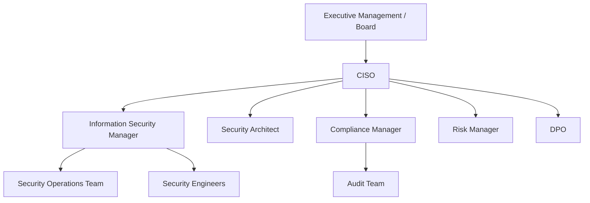

# Roles and Responsibilities (RACI Matrix)

## Overview

This document defines the roles and responsibilities for information security within Intra365 using a RACI (Responsible, Accountable, Consulted, Informed) matrix approach, in accordance with ISO 27001:2022 requirements.

## RACI Definitions

| Designation | Meaning | Description |
|-------------|---------|-------------|
| **R** - Responsible | Doer | The person(s) who perform the work to complete the task |
| **A** - Accountable | Owner | The person ultimately answerable for the activity's completion |
| **C** - Consulted | Advisor | People who provide input and must be consulted |
| **I** - Informed | Observer | People who need to be kept informed of progress or decisions |

**Key Principle**: There should be only ONE Accountable person per activity, but multiple Responsible parties are common.

## Key Security Roles

### Executive Management / Board
**Purpose**: Provide strategic direction, resources, and oversight for information security

**Responsibilities**:
- Approve master information security policy
- Allocate budget and resources for security program
- Review security performance and metrics
- Ensure compliance with legal and regulatory obligations
- Oversee risk acceptance for critical risks

**Qualifications**:
- Executive leadership experience
- Understanding of business risk management
- Commitment to security as business enabler

### Chief Information Security Officer (CISO)
**Purpose**: Lead and manage the information security program

**Responsibilities**:
- Develop and maintain ISMS
- Define security policies, standards, and procedures
- Manage security operations and incident response
- Oversee risk assessments and treatment
- Report security status to executive management
- Coordinate security awareness and training
- Manage security budget
- Ensure ISO 27001 compliance

**Qualifications**:
- 10+ years information security experience
- CISSP, CISM, or equivalent certification
- Leadership and management skills
- Knowledge of ISO 27001, NIST, and other frameworks

**Reports To**: CTO or CEO

### Information Security Manager (ISM)
**Purpose**: Day-to-day management of security operations

**Responsibilities**:
- Implement security policies and controls
- Manage security tools and technologies
- Coordinate security assessments and audits
- Monitor security metrics and KPIs
- Support incident response activities
- Manage security team members

**Qualifications**:
- 5+ years information security experience
- Security certifications (CISSP, CISM, Security+)
- Technical and operational security knowledge

**Reports To**: CISO

### Security Operations Team (SOC)
**Purpose**: Monitor, detect, and respond to security events and incidents

**Responsibilities**:
- 24/7 security monitoring
- Investigate security alerts and events
- Respond to security incidents
- Manage security tools (SIEM, IDS/IPS, etc.)
- Threat hunting and analysis
- Escalate incidents as needed

**Qualifications**:
- 2+ years security operations experience
- Knowledge of security tools and technologies
- Understanding of attack techniques and TTPs
- Certifications: Security+, CEH, or equivalent

**Reports To**: Information Security Manager

### Security Architect
**Purpose**: Design secure systems and architecture

**Responsibilities**:
- Define security architecture and design patterns
- Review and approve system architectures
- Conduct security architecture reviews
- Define security requirements for projects
- Research emerging security technologies
- Maintain security reference architectures

**Qualifications**:
- 7+ years security and architecture experience
- Deep technical knowledge
- Certifications: CISSP, SABSA, or equivalent

**Reports To**: CISO / CTO

### Security Engineers
**Purpose**: Implement and maintain security controls and tools

**Responsibilities**:
- Deploy and configure security tools
- Develop security automation
- Conduct vulnerability assessments
- Implement security controls
- Support DevSecOps initiatives
- Maintain security infrastructure

**Qualifications**:
- 3+ years security engineering experience
- Strong technical skills (scripting, networking, systems)
- Relevant certifications (GIAC, Offensive Security, etc.)

**Reports To**: Information Security Manager

### Compliance and Audit Manager
**Purpose**: Ensure compliance with regulations and standards

**Responsibilities**:
- Manage compliance program (ISO 27001, RAISE 2.0, etc.)
- Coordinate internal and external audits
- Track audit findings to closure
- Maintain compliance documentation
- Monitor regulatory changes
- Report compliance status

**Qualifications**:
- 5+ years compliance or audit experience
- Knowledge of ISO 27001, SOC 2, GDPR, etc.
- Certifications: CISA, ISO 27001 Lead Auditor

**Reports To**: CISO / Legal

### Risk Manager
**Purpose**: Manage information security risk program

**Responsibilities**:
- Conduct risk assessments
- Maintain risk register
- Coordinate risk treatment planning
- Monitor residual risks
- Report risk status to management
- Facilitate management reviews

**Qualifications**:
- 5+ years risk management experience
- Understanding of risk frameworks
- Certifications: CRISC, ISO 27001 Risk Manager

**Reports To**: CISO

### Data Protection Officer (DPO)
**Purpose**: Ensure data privacy and protection compliance

**Responsibilities**:
- Manage privacy program
- Ensure GDPR and privacy regulation compliance
- Conduct privacy impact assessments
- Handle data subject requests
- Coordinate with regulatory authorities
- Provide privacy training and awareness

**Qualifications**:
- Expert knowledge of data protection laws
- 5+ years privacy experience
- Certifications: CIPP, CIPM

**Reports To**: CISO / Legal

### Development Team (DevOps)
**Purpose**: Build and deploy secure applications

**Responsibilities**:
- Implement secure coding practices
- Conduct security testing (SAST, DAST)
- Address security vulnerabilities
- Integrate security into CI/CD
- Maintain secure configurations
- Participate in security reviews

**Qualifications**:
- Software development experience
- Knowledge of secure coding practices
- Understanding of AppSec tools

**Reports To**: CTO / Engineering Manager

### Operations Team
**Purpose**: Maintain secure operations and infrastructure

**Responsibilities**:
- Implement security controls
- Manage patching and updates
- Monitor system health and security
- Execute backup and recovery procedures
- Respond to operational incidents
- Maintain security of infrastructure

**Qualifications**:
- Systems administration experience
- Knowledge of security best practices
- Relevant certifications (Linux+, MCSE, etc.)

**Reports To**: Operations Manager

### Human Resources (HR)
**Purpose**: Manage people-related security controls

**Responsibilities**:
- Conduct pre-employment screening
- Manage security clauses in employment contracts
- Coordinate security awareness training
- Handle disciplinary processes for security violations
- Manage termination procedures
- Maintain confidentiality agreements

**Qualifications**:
- HR management experience
- Understanding of employment law
- Knowledge of security requirements

**Reports To**: HR Director

### Legal and Compliance
**Purpose**: Ensure legal and regulatory compliance

**Responsibilities**:
- Review contracts for security requirements
- Advise on legal and regulatory obligations
- Manage NDA and confidentiality agreements
- Support incident response (legal aspects)
- Handle regulatory reporting
- Coordinate with external counsel

**Qualifications**:
- Legal degree and bar admission
- Knowledge of technology law
- Experience with security and privacy regulations

**Reports To**: General Counsel

### All Employees and Contractors
**Purpose**: Follow security policies and practices

**Responsibilities**:
- Comply with security policies and procedures
- Complete required security training
- Report security incidents and concerns
- Protect company and customer information
- Use security tools properly
- Maintain confidentiality

**Qualifications**:
- Security awareness training
- Understanding of role-specific security requirements

## RACI Matrix: ISMS Management

| Activity | Exec Mgmt | CISO | ISM | Compliance | Risk Mgr | All Staff |
|----------|-----------|------|-----|------------|----------|-----------|
| **Establish ISMS** | A | R | C | C | C | I |
| **Approve Security Policy** | A | R | C | C | - | I |
| **Set Security Objectives** | A | R | C | - | C | I |
| **Allocate Resources** | A | C | R | - | - | I |
| **Management Review** | A/R | R | R | R | R | I |
| **ISMS Improvements** | A | R | R | C | C | I |

## RACI Matrix: Risk Management

| Activity | Exec Mgmt | CISO | Risk Mgr | Asset Owners | Security Team | All Staff |
|----------|-----------|------|----------|--------------|---------------|-----------|
| **Risk Assessment** | I | A | R | C | C | - |
| **Risk Analysis** | I | A | R | C | R | - |
| **Risk Treatment Planning** | C | A | R | R | C | - |
| **Risk Acceptance** | A | C | C | R | - | - |
| **Risk Monitoring** | I | A | R | C | R | - |
| **Risk Reporting** | I | A | R | - | C | - |

## RACI Matrix: Security Controls Implementation

### Organizational Controls (A.5)

| Control | CISO | Compliance | Legal | HR | Operations | DevOps |
|---------|------|------------|-------|-----|------------|--------|
| **A.5.1 Security Policies** | A/R | C | C | C | I | I |
| **A.5.2 Roles & Responsibilities** | A/R | C | C | R | C | C |
| **A.5.3 Segregation of Duties** | A | R | C | - | R | R |
| **A.5.5 Contact Authorities** | C | A/R | R | - | I | I |
| **A.5.7 Threat Intelligence** | A | I | - | - | R | I |
| **A.5.23 Cloud Security** | A | C | C | - | R | C |
| **A.5.24-28 Incident Mgmt** | I | C | I | - | A/R | C |
| **A.5.29-30 Business Continuity** | A | C | - | - | R | C |

### People Controls (A.6)

| Control | HR | CISO | Legal | Line Mgrs | All Staff |
|---------|-----|------|-------|-----------|-----------|
| **A.6.1 Screening** | A/R | C | C | I | - |
| **A.6.2 Employment Terms** | A/R | C | C | I | - |
| **A.6.3 Awareness Training** | R | A | - | C | R |
| **A.6.4 Disciplinary Process** | A/R | C | C | R | - |
| **A.6.5 Termination** | A/R | C | - | R | - |
| **A.6.6 Confidentiality Agreements** | R | C | A/R | I | - |
| **A.6.7 Remote Working** | C | A | - | R | R |
| **A.6.8 Event Reporting** | I | A | - | C | R |

### Physical Controls (A.7)

| Control | Facilities | CISO | Operations | All Staff |
|---------|-----------|------|------------|-----------|
| **A.7.1 Physical Perimeters** | A/R | C | C | I |
| **A.7.2 Physical Entry** | A/R | C | C | R |
| **A.7.7 Clear Desk/Screen** | C | A | C | R |
| **A.7.8 Equipment Protection** | R | A | R | R |
| **A.7.9 Off-Premises Assets** | C | A | R | R |
| **A.7.14 Secure Disposal** | R | A | R | C |

### Technological Controls (A.8)

| Control | Security Team | Operations | DevOps | Asset Owners |
|---------|---------------|------------|--------|--------------|
| **A.8.1 User Endpoints** | A | R | C | R |
| **A.8.2 Privileged Access** | A/R | R | C | C |
| **A.8.3 Access Restriction** | A | R | C | R |
| **A.8.5 Authentication** | A/R | R | C | R |
| **A.8.7 Malware Protection** | A | R | C | R |
| **A.8.8 Vulnerability Mgmt** | A/R | R | R | C |
| **A.8.15 Logging** | A | R | C | R |
| **A.8.16 Monitoring** | A/R | R | C | I |
| **A.8.24 Cryptography** | A/R | R | R | C |
| **A.8.25 Secure Dev Lifecycle** | A | C | R | C |
| **A.8.28 Secure Coding** | A | - | R | - |
| **A.8.32 Change Management** | C | A/R | R | C |

## RACI Matrix: Incident Management

| Activity | Exec Mgmt | CISO | SOC | Legal | HR | Communications |
|----------|-----------|------|-----|-------|-----|----------------|
| **Incident Detection** | I | I | A/R | - | - | - |
| **Initial Assessment** | I | A | R | - | - | - |
| **Escalation** | I | A | R | C | C | C |
| **Investigation** | I | A | R | C | - | - |
| **Containment** | I | A | R | - | - | - |
| **Recovery** | I | A | R | - | - | - |
| **Communication (External)** | A | C | C | C | - | R |
| **Lessons Learned** | I | A | R | C | C | C |
| **Regulatory Reporting** | I | A | C | R | - | - |

## RACI Matrix: Compliance and Audit

| Activity | Exec Mgmt | CISO | Compliance Mgr | Risk Mgr | Control Owners | Auditors |
|----------|-----------|------|----------------|----------|----------------|----------|
| **Audit Planning** | I | A | R | C | C | C |
| **Audit Execution** | I | C | R | C | R | A/R |
| **Finding Documentation** | I | C | C | - | C | A/R |
| **Corrective Actions** | I | A | C | C | R | I |
| **Follow-up Verification** | I | A | R | C | R | A/R |
| **Compliance Reporting** | I | A | R | C | - | - |
| **Certification Maintenance** | A | R | R | C | C | - |

## RACI Matrix: Security Awareness and Training

| Activity | HR | CISO | Line Mgrs | Training Team | All Staff |
|----------|-----|------|-----------|---------------|-----------|
| **Training Needs Assessment** | C | A | C | R | - |
| **Content Development** | C | A | C | R | - |
| **Training Delivery** | R | A | C | R | R |
| **Completion Tracking** | R | A | - | R | R |
| **Effectiveness Assessment** | C | A | C | R | C |
| **Ongoing Awareness** | R | A | R | R | I |

## Role Transitions and Succession

### Onboarding
- Security briefing for all new hires
- Role-specific security training
- Access provisioning per least privilege
- Assignment of security responsibilities
- Introduction to security team and resources

### Role Changes
- Re-assessment of access requirements
- Update of security responsibilities
- Additional training if needed
- Communication of changes to team
- Update of RACI matrix if needed

### Offboarding
- Access revocation
- Return of assets
- Exit interview covering security
- Knowledge transfer
- Removal from security systems

### Succession Planning
- Identify critical security roles
- Document role responsibilities and knowledge
- Cross-train team members
- Maintain backup for key positions
- Regular rotation for specific duties

## Training and Competence Requirements

### Role-Based Training Matrix

| Role | Foundational | Technical | Management | Compliance | Frequency |
|------|--------------|-----------|------------|-----------|-----------|
| **Executive Management** | ISO 27001 Awareness | - | ISMS Management | Regulatory Overview | Annual |
| **CISO** | ISO 27001 Lead Implementer | Advanced Security | Leadership | Multi-framework | Annual + Continuous |
| **Security Team** | ISO 27001 Practitioner | Security Tools & Techniques | - | Compliance Requirements | Quarterly |
| **DevOps** | Security Basics | Secure Coding, DevSecOps | - | - | Quarterly |
| **Operations** | Security Basics | Security Operations | - | - | Quarterly |
| **All Staff** | Security Awareness | - | - | - | Annual |

### Certification Requirements

**CISO/Security Leadership**:
- CISSP (Certified Information Systems Security Professional)
- CISM (Certified Information Security Manager)
- ISO 27001 Lead Implementer
- One of: CRISC, CGEIT, SABSA

**Security Practitioners**:
- Security+ or equivalent foundational certification
- Role-specific: GCIH, GCIA, CEH, OSCP, etc.
- ISO 27001 Internal Auditor (for audit team)

**Compliance/Audit**:
- CISA (Certified Information Systems Auditor)
- ISO 27001 Lead Auditor
- CRISC (Certified in Risk and Information Systems Control)

### Continuing Education

- Minimum 40 CPE hours per year for certified professionals
- Attendance at security conferences
- Participation in security community
- Regular training on emerging threats and technologies

## Performance Metrics

### Role Effectiveness Metrics

| Role | Key Metrics |
|------|-------------|
| **CISO** | ISMS maturity, audit findings, incident response time, security awareness completion |
| **SOC** | MTTD, MTTR, false positive rate, incident escalation time |
| **Compliance** | Audit findings closure rate, compliance score, certification maintenance |
| **Risk Manager** | Risk treatment completion, residual risk acceptance, risk register accuracy |
| **Security Engineers** | Vulnerability remediation time, automation coverage, tool uptime |
| **All Staff** | Training completion, incident reporting, policy compliance |

### Team Performance

- Incident response effectiveness
- Control implementation progress
- Compliance status
- Audit results
- Security metrics trends

## Authority and Escalation

### Decision Authority

| Decision Type | Authority | Escalation Path |
|---------------|-----------|----------------|
| **Critical Risk Acceptance** | Executive Management | Board |
| **High Risk Acceptance** | CISO | Executive Management |
| **Policy Approval** | CISO | Executive Management |
| **Security Incidents (Critical)** | CISO | Executive Management |
| **Budget Allocation** | CISO | Executive Management |
| **Personnel Actions** | HR + CISO | Executive Management |

### Escalation Triggers

- Critical security incidents
- Risk levels exceeding tolerance
- Resource constraints impacting security
- Compliance violations
- Failed audits
- Major vulnerabilities

## Organizational Structure

## Matrix Management

For matrix organization with dotted-line reporting:
- CISO has functional authority over security matters
- Line managers have administrative authority
- Security requirements override business convenience
- Conflicts escalated to executive management
- Regular communication between security and business units

## Third-Party Roles

### External Auditors
- Independent verification of ISMS
- ISO 27001 certification audits
- Report to executive management
- No operational responsibilities

### Consultants and Contractors
- Defined scope and duration
- Supervised by Intra365 staff
- Sign NDAs and security agreements
- Limited access per least privilege
- Regular performance reviews

### Managed Service Providers
- Specific services per contract
- Monitored by Intra365 security team
- Subject to security assessments
- Incident notification requirements
- Right to audit clauses

## Related Documents

- [ISMS Framework](isms-framework)
- [Security Policy Framework](security-policy-framework)
- [Information Security Roles](information-security-roles)
- [Management Responsibilities](management-responsibilities)
- [Segregation of Duties](segregation-of-duties)

---

**Questions or feedback?** [Open an issue](https://github.com/intra365/chef/issues) or [start a discussion](https://github.com/intra365/chef/discussions).
