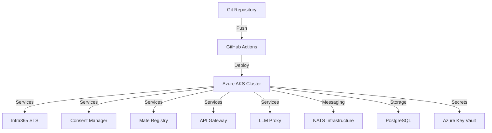

# Overview

Welcome to **Intra365 Chef** - the GitOps deployment orchestration system that serves as the brain binding all Intra365 services together.

## What is Chef?

Chef is the central deployment orchestration system for the Intra365 enterprise integration framework. It manages the deployment, configuration, and lifecycle of all Intra365 services across Kubernetes clusters (Azure AKS).

## Purpose

Chef serves as the **GitOps brain** for Intra365, providing:

- **GitOps-driven deployments**: Infrastructure and application state managed declaratively through Git
- **Service orchestration**: Coordinates deployment of all Intra365 Mates (microservices)
- **Configuration management**: Centralized configuration and secrets management via Azure Key Vault CSI
- **Multi-environment support**: Seamless deployments across development, staging, and production environments
- **Convention over configuration**: Standardized deployment patterns that reduce boilerplate
- **Prompt-based configuration**: Adaptable platform setup using AI-assisted prompts instead of rigid IaC

## Key Features

### 🔄 GitOps Workflow
All deployments are triggered by Git commits, ensuring version control, auditability, and rollback capabilities.

### 🚀 Automated Deployments
GitHub Actions workflows automatically deploy services when changes are merged to main branches.

### 🔒 Zero-Trust Security
Integration with Azure Key Vault, network policies, and RAISE 2.0 DevSecOps compliance.

### 📊 Observability
Built-in monitoring, logging, and tracing for all deployed services.

### 🎯 Service Discovery
Automatic service registration and discovery through NATS messaging infrastructure.

## Architecture at a Glance

## Who Should Use This Documentation?

This documentation is designed for:

- **DevOps Engineers**: Setting up and maintaining Chef infrastructure
- **Developers**: Deploying and configuring Intra365 services
- **Platform Engineers**: Architecting multi-environment deployments
- **Security Engineers**: Implementing compliance and security controls
- **Operations Teams**: Monitoring, troubleshooting, and incident response

## Getting Started

Ready to dive in? Start with:

1. [Key Concepts](./02-key-concepts.md) - Understanding GitOps and Chef's role
2. [Quick Start](./03-quick-start.md) - Deploy your first service in 5 minutes
3. [Architecture Overview](./04-architecture-overview.md) - High-level system design

## Documentation Structure

Our documentation follows a **numeric-prefixed structure** for logical navigation:

- **010-Introduction**: Getting started and core concepts
- **020-Architecture**: System design and patterns
- **030-Infrastructure**: Platform setup and configuration
- **040-Deployment Workflows**: Deployment processes
- **050-Service Configurations**: Service-specific guides
- **060-Security & Compliance**: Security implementation
- **070-Operations Runbooks**: Day-to-day operations
- **080-Troubleshooting**: Common issues and debugging
- **090-Reference**: API, CLI, and configuration reference
- **100-Contributing**: Contribution guidelines
- **110-Roadmap**: Future plans and evolution

## Need Help?

- **GitHub Issues**: [Report bugs or request features](https://github.com/intra365/chef/issues)
- **GitHub Discussions**: [Ask questions and share ideas](https://github.com/intra365/chef/discussions)
- **Intra365 Specs**: [Review full specifications](https://github.com/happy-mates/happy-mates-intra365)

---

**Ready to orchestrate?** Let's get started with [Key Concepts](./02-key-concepts.md)!
