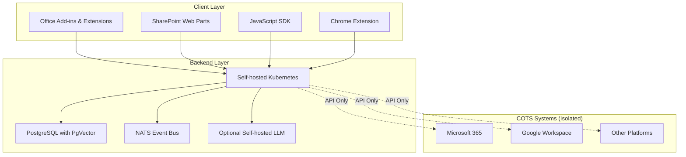
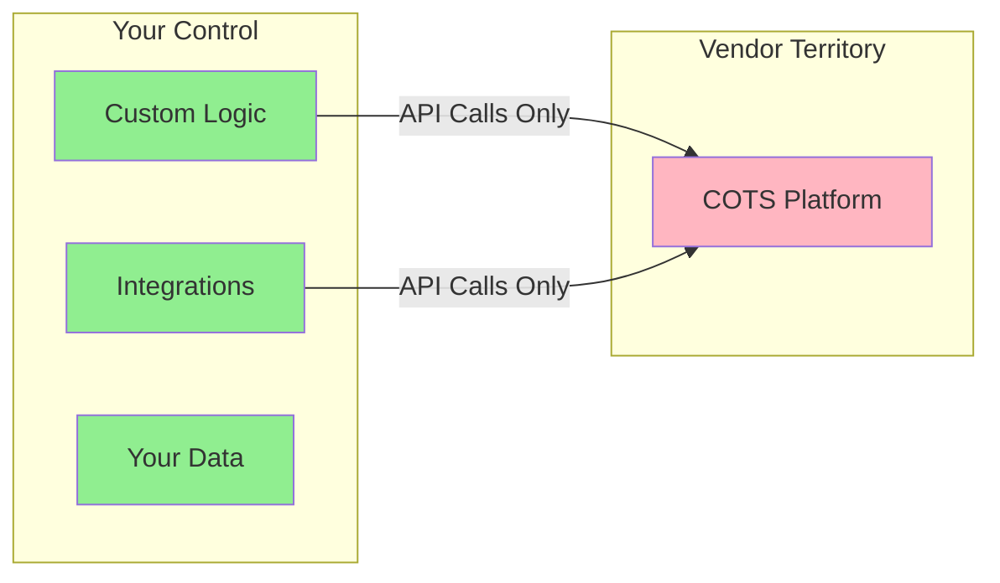
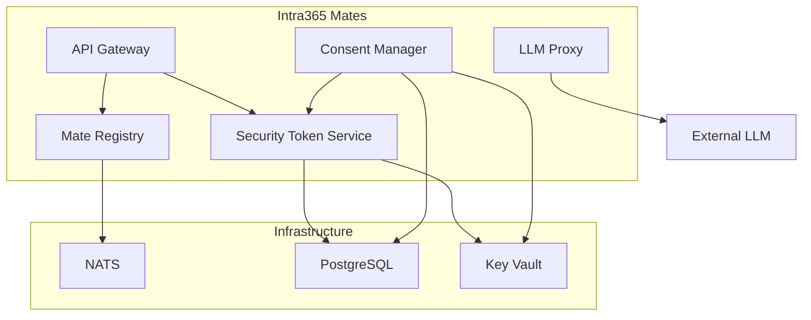

# System Architecture

The Intra365 system architecture is built on the **ICING** (Intranet Connectivity, Integration & Governance) framework, which provides a comprehensive approach to enterprise integration while maintaining complete isolation from COTS products.

## ICING Architecture Overview

ICING consists of two primary layers that work together to deliver a complete integration solution:

## Client-Side Layer

The client-side layer provides integration points within user-facing applications:

### Office Add-ins and Extensions
Integrate directly within Microsoft Office applications (Word, Excel, PowerPoint, Outlook), providing contextual functionality without modifying the core COTS product.

### SharePoint Web Parts and Extensions
Connect ICING services to intranet portals through custom web parts and application customizers, enabling seamless user experiences.

### JavaScript SDK
Enables deep integration with web apps and portals, providing a consistent API for client-side developers regardless of the underlying platform.

### Chrome Extension
Provides cross-site UI enhancements and workflow triggers, extending functionality beyond platform-native capabilities.

## Backend Layer

The backend layer hosts all custom logic and integration services in a self-managed environment:

### Self-hosted Kubernetes
Orchestrates ICING microservices (called "Mates") with:
- Container orchestration and scaling
- Service mesh for inter-service communication
- Health monitoring and auto-recovery
- GitOps-based deployments

### PostgreSQL (with PgVector)
Serves as the persistent store for:
- Application data
- Context and state management
- Vector embeddings for AI-powered search
- Audit logs and compliance data

### NATS Event Bus
Enables event-driven communication and orchestration (NATS or Kafka can be used):
- Asynchronous message passing
- Publish-subscribe patterns
- Request-reply patterns
- Stream processing

### Optional Self-hosted LLM
Enables secure, isolated AI reasoning and automation:
- On-premises language models
- Context-aware assistance
- Data privacy compliance
- Custom fine-tuning

## Isolation Principle

The key architectural principle of ICING is **isolation from COTS systems**:

### Benefits of Isolation

1. **Portability**: Move between Microsoft 365, Google Workspace, or any platform without rewriting business logic
2. **Control**: Own your deployment, data, and upgrade cycles
3. **Flexibility**: Add features without vendor permission or limitations
4. **Cost Predictability**: Avoid vendor lock-in and licensing complexity
5. **Compliance**: Maintain data sovereignty and audit requirements

## Intra365 Service Architecture

Within the backend layer, Intra365 implements several core services (Mates):

### Core Services

- **API Gateway**: Entry point for all client requests, handles routing and authentication
- **Security Token Service (STS)**: Manages authentication and authorization tokens
- **Consent Manager**: Tracks user consent for data processing and integrations
- **Mate Registry**: Service discovery and health monitoring
- **LLM Proxy**: Secure gateway to language model capabilities

## Deployment Model

ICING services are deployed using GitOps principles:

1. **Infrastructure as Code**: Kubernetes manifests in Git
2. **Automated Deployments**: GitHub Actions triggers on commits
3. **Environment Promotion**: Dev → Staging → Production
4. **Rollback Capability**: Git revert for instant recovery
5. **Configuration Management**: Azure Key Vault CSI for secrets

## Security Architecture

Security follows zero-trust principles with multiple layers:

- **Network Policies**: Service-to-service communication controls
- **Identity Verification**: Every request authenticated via STS
- **Encryption**: TLS for transit, encryption at rest for data
- **Secrets Management**: Azure Key Vault with CSI driver
- **Audit Logging**: Comprehensive activity tracking

## Next Steps

- [Integration Points](./04-integration-points.md) - How ICING connects to COTS systems
- [Deployment Pipeline](./05-deployment-pipeline.md) - CI/CD workflow details
- [Infrastructure Setup](../030-infrastructure/01-azure-aks-setup.md) - Deploy your ICING backend

---

**Questions?** [Open an issue](https://github.com/intra365/chef/issues) or [start a discussion](https://github.com/intra365/chef/discussions).
