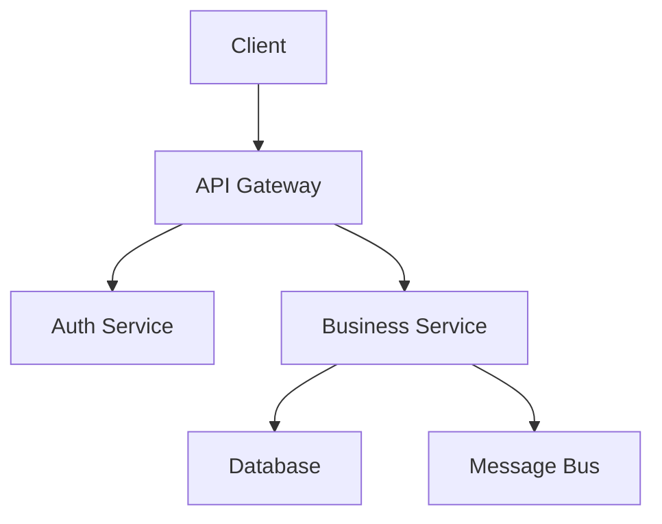

# Solution Architect

Solution Architects design and oversee the implementation of specific solutions within the Intra365 platform. They translate business requirements into technical designs, define integration patterns, make technology choices, and ensure solutions meet quality, security, and scalability requirements.

## Role Profile

### Primary Responsibilities
- Design technical solutions for business requirements
- Define system components and their interactions
- Choose appropriate technologies and frameworks
- Design APIs and integration patterns
- Create technical specifications and architecture documents
- Review code and ensure architectural compliance
- Collaborate with development teams on implementation
- Balance technical excellence with practical constraints

### Key Skills
- Deep technical expertise in relevant technologies
- Strong understanding of software design patterns
- Experience with distributed systems and microservices
- API design and integration expertise
- Knowledge of cloud platforms (Azure, Kubernetes)
- Security and compliance understanding
- Problem-solving and analytical thinking
- Ability to communicate technical concepts clearly

### Daily Activities
- Designing solutions for new features and projects
- Creating technical specifications and diagrams
- Reviewing pull requests for architectural adherence
- Collaborating with developers on implementation details
- Meeting with stakeholders to understand requirements
- Troubleshooting complex technical issues
- Mentoring developers on architectural concepts

## Documentation Priorities

### Essential Reading
1. **[System Architecture](../../010-guides/020-architecture/01-system-architecture.md)** - Overall system design
2. **[Integration Points](../../010-guides/020-architecture/04-integration-points.md)** - Integration approaches
3. **[Component Diagram](../../010-guides/020-architecture/03-component-diagram.md)** - Data movement patterns
4. **[GitOps Workflow](../../010-guides/020-architecture/02-gitops-workflow.md)** - Platform technologies

### Architecture & Design
- **[Architecture Overview](../../010-guides/020-architecture/01-system-architecture.md)** - Complete architecture guide
- **[GitOps Workflow](../../010-guides/020-architecture/02-gitops-workflow.md)** - Deployment methodology
- **[Deployment Pipeline](../../010-guides/020-architecture/05-deployment-pipeline.md)** - CI/CD architecture
- **[Multi-Environment](../../010-guides/020-architecture/06-multi-environment.md)** - Environment strategy

### Service Design
- **[Service Structure](../../010-guides/050-service-configurations/01-service-structure.md)** - Service organization
- **[Intra365 Gateway](../../010-guides/050-service-configurations/05-intra365-gateway.md)** - API Gateway design
- **[Intra365 STS](../../010-guides/050-service-configurations/02-intra365-sts.md)** - Security Token Service
- **[NATS Infrastructure](../../010-guides/050-service-configurations/07-nats-infrastructure.md)** - Message bus patterns

### Security & Compliance
- **[Zero Trust Architecture](../../010-guides/060-security-compliance/010-core-security/01-zero-trust-architecture.md)** - Security model
- **[Container Security](../../010-guides/060-security-compliance/010-core-security/04-container-security.md)** - Container security
- **[Network Policies](../../010-guides/060-security-compliance/010-core-security/05-network-policies.md)** - Network security

### Infrastructure
- **[Azure AKS Setup](../../010-guides/030-infrastructure/01-azure-aks-setup.md)** - Kubernetes platform
- **[Networking](../../010-guides/030-infrastructure/02-networking.md)** - Network architecture
- **[Storage](../../010-guides/030-infrastructure/03-storage.md)** - Data persistence
- **[Scaling Strategy](../../010-guides/030-infrastructure/07-scaling-strategy.md)** - Scalability approaches

## Solution Design Tasks

### Creating Technical Design Documents

```markdown
# Technical Design Document Template

## 1. Overview
- **Project/Feature Name**: 
- **Architect**: 
- **Date**: 
- **Status**: Draft | Under Review | Approved
- **Version**: 1.0

## 2. Business Context
- Problem statement
- Business objectives
- Success criteria
- Constraints and assumptions

## 3. Requirements
### Functional Requirements
- User stories or use cases
- Expected behavior

### Non-Functional Requirements
- Performance targets (response time, throughput)
- Scalability requirements
- Availability targets (uptime %)
- Security requirements
- Compliance requirements

## 4. Solution Design

### High-Level Architecture


### Components
- Component descriptions
- Responsibilities
- Technologies used

### Data Model
- Entity relationships
- Key data structures
- Data flow

### APIs
- Endpoint definitions
- Request/response formats
- Authentication/authorization

### Integration Points
- External systems
- Internal services
- Message patterns

## 5. Implementation Plan
- Development phases
- Dependencies
- Milestones
- Testing strategy

## 6. Security Considerations
- Authentication and authorization
- Data encryption
- Network security
- Secrets management
- Compliance requirements

## 7. Operational Considerations
- Deployment strategy
- Monitoring and alerting
- Logging requirements
- Backup and recovery
- Disaster recovery

## 8. Risks and Mitigations
| Risk | Impact | Probability | Mitigation |
|------|--------|-------------|------------|
|      |        |             |            |

## 9. Alternatives Considered
- Alternative approaches
- Rationale for chosen solution

## 10. Open Questions
- Unresolved issues
- Decisions needed
```

### API Design

```yaml
# OpenAPI 3.0 Specification Example
openapi: 3.0.0
info:
  title: User Management API
  version: 1.0.0
  description: API for managing users in the Intra365 platform
  contact:
    name: Solution Architect Team
    email: architects@intra365.io

servers:
  - url: https://api.intra365.io/v1
    description: Production
  - url: https://staging-api.intra365.io/v1
    description: Staging

security:
  - bearerAuth: []

paths:
  /users:
    get:
      summary: List users
      description: Retrieve a paginated list of users
      parameters:
        - name: page
          in: query
          schema:
            type: integer
            default: 1
        - name: limit
          in: query
          schema:
            type: integer
            default: 20
            maximum: 100
      responses:
        '200':
          description: Successful response
          content:
            application/json:
              schema:
                type: object
                properties:
                  data:
                    type: array
                    items:
                      $ref: '#/components/schemas/User'
                  pagination:
                    $ref: '#/components/schemas/Pagination'
        '401':
          $ref: '#/components/responses/Unauthorized'
        '500':
          $ref: '#/components/responses/InternalError'
    
    post:
      summary: Create user
      description: Create a new user account
      requestBody:
        required: true
        content:
          application/json:
            schema:
              $ref: '#/components/schemas/CreateUserRequest'
      responses:
        '201':
          description: User created successfully
          content:
            application/json:
              schema:
                $ref: '#/components/schemas/User'
        '400':
          $ref: '#/components/responses/BadRequest'
        '401':
          $ref: '#/components/responses/Unauthorized'
        '409':
          description: User already exists

  /users/{userId}:
    get:
      summary: Get user by ID
      parameters:
        - name: userId
          in: path
          required: true
          schema:
            type: string
            format: uuid
      responses:
        '200':
          description: Successful response
          content:
            application/json:
              schema:
                $ref: '#/components/schemas/User'
        '404':
          $ref: '#/components/responses/NotFound'

components:
  securitySchemes:
    bearerAuth:
      type: http
      scheme: bearer
      bearerFormat: JWT

  schemas:
    User:
      type: object
      properties:
        id:
          type: string
          format: uuid
        email:
          type: string
          format: email
        name:
          type: string
        role:
          type: string
          enum: [admin, user, readonly]
        createdAt:
          type: string
          format: date-time
        updatedAt:
          type: string
          format: date-time

    CreateUserRequest:
      type: object
      required:
        - email
        - name
        - role
      properties:
        email:
          type: string
          format: email
        name:
          type: string
          minLength: 2
        role:
          type: string
          enum: [admin, user, readonly]

    Pagination:
      type: object
      properties:
        page:
          type: integer
        limit:
          type: integer
        total:
          type: integer
        totalPages:
          type: integer

  responses:
    BadRequest:
      description: Bad request
      content:
        application/json:
          schema:
            $ref: '#/components/schemas/Error'
    
    Unauthorized:
      description: Unauthorized
      content:
        application/json:
          schema:
            $ref: '#/components/schemas/Error'
    
    NotFound:
      description: Resource not found
      content:
        application/json:
          schema:
            $ref: '#/components/schemas/Error'
    
    InternalError:
      description: Internal server error
      content:
        application/json:
          schema:
            $ref: '#/components/schemas/Error'
```

### Integration Pattern Design

```yaml
# Event-Driven Integration Pattern
event_driven:
  pattern: Publish/Subscribe
  use_case: "User registration triggers multiple downstream actions"
  
  components:
    publisher:
      service: user-service
      event: user.registered
      payload:
        userId: uuid
        email: string
        registeredAt: timestamp
    
    message_broker:
      technology: NATS
      subject: events.user.registered
      delivery: at-least-once
    
    subscribers:
      - service: email-service
        action: Send welcome email
        handling: async
      
      - service: analytics-service
        action: Track user registration
        handling: async
      
      - service: provisioning-service
        action: Create default resources
        handling: async
  
  benefits:
    - Loose coupling between services
    - Easy to add new subscribers
    - Better scalability
    - Fault isolation
  
  considerations:
    - Eventual consistency
    - Message ordering
    - Duplicate message handling
    - Dead letter queue for failures

# Request/Reply Pattern
request_reply:
  pattern: Synchronous RPC
  use_case: "User authentication check"
  
  components:
    requester:
      service: api-gateway
      request: auth.verify
      timeout: 2s
    
    responder:
      service: auth-service
      action: Verify JWT token
      response: user_claims | error
  
  benefits:
    - Simple to understand
    - Strong consistency
    - Immediate feedback
  
  considerations:
    - Tight coupling
    - Failure propagation
    - Timeout management
    - Circuit breaker needed
```

### Database Design

```sql
-- Example: Database schema design with documentation

-- Users table
CREATE TABLE users (
    id UUID PRIMARY KEY DEFAULT gen_random_uuid(),
    email VARCHAR(255) UNIQUE NOT NULL,
    name VARCHAR(255) NOT NULL,
    role VARCHAR(50) NOT NULL CHECK (role IN ('admin', 'user', 'readonly')),
    password_hash VARCHAR(255) NOT NULL,
    email_verified BOOLEAN DEFAULT FALSE,
    created_at TIMESTAMP WITH TIME ZONE DEFAULT CURRENT_TIMESTAMP,
    updated_at TIMESTAMP WITH TIME ZONE DEFAULT CURRENT_TIMESTAMP,
    deleted_at TIMESTAMP WITH TIME ZONE
);

COMMENT ON TABLE users IS 'User accounts for the Intra365 platform';
COMMENT ON COLUMN users.email IS 'User email address, used for login';
COMMENT ON COLUMN users.role IS 'User role: admin, user, or readonly';
COMMENT ON COLUMN users.deleted_at IS 'Soft delete timestamp, NULL if active';

-- Create indexes
CREATE INDEX idx_users_email ON users(email) WHERE deleted_at IS NULL;
CREATE INDEX idx_users_role ON users(role) WHERE deleted_at IS NULL;
CREATE INDEX idx_users_created_at ON users(created_at DESC);

-- User sessions table
CREATE TABLE user_sessions (
    id UUID PRIMARY KEY DEFAULT gen_random_uuid(),
    user_id UUID NOT NULL REFERENCES users(id) ON DELETE CASCADE,
    token_hash VARCHAR(255) NOT NULL,
    expires_at TIMESTAMP WITH TIME ZONE NOT NULL,
    created_at TIMESTAMP WITH TIME ZONE DEFAULT CURRENT_TIMESTAMP,
    last_activity_at TIMESTAMP WITH TIME ZONE DEFAULT CURRENT_TIMESTAMP
);

COMMENT ON TABLE user_sessions IS 'Active user sessions';

CREATE INDEX idx_sessions_user_id ON user_sessions(user_id);
CREATE INDEX idx_sessions_expires_at ON user_sessions(expires_at);
CREATE INDEX idx_sessions_token_hash ON user_sessions(token_hash);

-- Audit log table
CREATE TABLE audit_log (
    id BIGSERIAL PRIMARY KEY,
    user_id UUID REFERENCES users(id),
    action VARCHAR(100) NOT NULL,
    resource_type VARCHAR(100),
    resource_id VARCHAR(255),
    changes JSONB,
    ip_address INET,
    user_agent TEXT,
    created_at TIMESTAMP WITH TIME ZONE DEFAULT CURRENT_TIMESTAMP
);

COMMENT ON TABLE audit_log IS 'Audit trail for user actions';

CREATE INDEX idx_audit_user_id ON audit_log(user_id);
CREATE INDEX idx_audit_created_at ON audit_log(created_at DESC);
CREATE INDEX idx_audit_action ON audit_log(action);

-- Partitioning for audit log (by month)
CREATE TABLE audit_log_y2024m01 PARTITION OF audit_log
    FOR VALUES FROM ('2024-01-01') TO ('2024-02-01');
```

## Solution Architecture Best Practices

### Design Principles

- **SOLID Principles**: Single Responsibility, Open/Closed, Liskov Substitution, Interface Segregation, Dependency Inversion
- **DRY (Don't Repeat Yourself)**: Avoid duplication in logic and data
- **KISS (Keep It Simple, Stupid)**: Prefer simple solutions over complex ones
- **YAGNI (You Aren't Gonna Need It)**: Don't build features before they're needed
- **Separation of Concerns**: Separate different aspects of the system
- **Fail Fast**: Detect and report errors early
- **Defense in Depth**: Multiple layers of security controls

### API Design Best Practices

- Use RESTful conventions and HTTP methods appropriately
- Version APIs (URL-based: `/v1/resource`)
- Consistent naming conventions (kebab-case for URLs)
- Comprehensive error responses with proper status codes
- Pagination for list endpoints
- Rate limiting and throttling
- OpenAPI/Swagger documentation
- Support for filtering, sorting, and field selection

### Microservices Design

- Domain-Driven Design for service boundaries
- Single responsibility per service
- Independent deployment and scaling
- Database per service pattern
- API-first design approach
- Asynchronous communication for loose coupling
- Circuit breakers for resilience
- Comprehensive observability

### Security by Design

- Authentication and authorization at every layer
- Principle of least privilege
- Input validation and sanitization
- Secure secret management
- Encryption at rest and in transit
- Regular security reviews
- Compliance requirements built-in (ISO 27001, RAISE 2.0)

### Performance Optimization

- Design for horizontal scalability
- Use caching strategically (Redis)
- Optimize database queries and indexes
- Implement connection pooling
- Asynchronous processing for long-running tasks
- CDN for static content
- Load testing before production

## Tools & Technologies

### Design & Modeling
- **Draw.io**: Architecture diagrams
- **Mermaid**: Diagram as code
- **Lucidchart**: Collaborative diagramming
- **PlantUML**: UML diagrams as code

### API Design
- **Swagger/OpenAPI**: API specification
- **Postman**: API testing and documentation
- **Stoplight**: API design platform

### Development
- **VS Code**: Code editor
- **Git**: Version control
- **Docker**: Containerization
- **Kubernetes**: Orchestration

### Analysis & Documentation
- **Markdown**: Documentation
- **Confluence**: Collaborative documentation
- **ADR Tools**: Architecture decisions
- **Miro**: Collaborative whiteboarding

## Related Personas

- **[Enterprise Architect](./enterprise-architect.md)**: Ensure solution aligns with enterprise architecture
- **[Technical Lead](./technical-lead.md)**: Collaborate on implementation details
- **[Developer](../040-technical-practitioner/developer.md)** Implement the designed solutions
- **[DevOps Engineer](../040-technical-practitioner/devops-engineer.md)**: Work on deployment architecture
- **[Security Engineer](../040-technical-practitioner/security-engineer.md)**: Ensure security requirements are met

## Additional Resources

- [Azure Architecture Center](https://docs.microsoft.com/en-us/azure/architecture/)
- [Microservices Patterns](https://microservices.io/patterns/)
- [Martin Fowler's Blog](https://martinfowler.com/)
- [Domain-Driven Design](https://www.domainlanguage.com/ddd/)
- [API Design Best Practices](https://swagger.io/resources/articles/best-practices-in-api-design/)
- [The Twelve-Factor App](https://12factor.net/)
