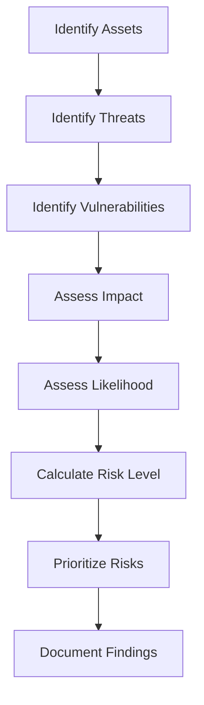
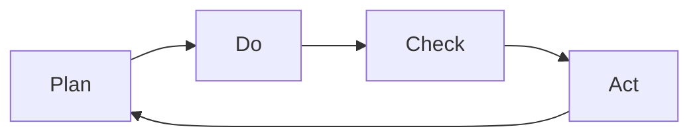

# Information Security Management System (ISMS) Framework

## Overview

The Information Security Management System (ISMS) is a systematic approach to managing sensitive information to ensure its confidentiality, integrity, and availability. This document outlines the ISMS framework for the Intra365 platform based on ISO 27001:2022 requirements.

## ISMS Definition

An ISMS is a framework of policies, procedures, and controls that:
- Protects information assets from security threats
- Manages information security risks systematically
- Ensures business continuity
- Provides confidence to stakeholders
- Enables continuous improvement

### Key Principles
1. **Risk-Based Approach**: Focus on risks specific to the organization
2. **Process Orientation**: Systematic approach to managing information security
3. **Continuous Improvement**: Regular review and enhancement (PDCA cycle)
4. **Management Commitment**: Top-level support and engagement
5. **Stakeholder Engagement**: Involvement of all relevant parties

## ISMS Scope

### Organizational Scope
The ISMS applies to:
- **Intra365 Platform**: All services, components, and integrations
- **Development Teams**: Source code, CI/CD, testing environments
- **Operations Teams**: Infrastructure, monitoring, incident response
- **Support Functions**: IT, HR, legal, compliance
- **Third-Party Services**: Cloud providers, suppliers, contractors

### Physical and Logical Boundaries
- **Physical**: Azure data centers, office locations, remote work environments
- **Logical**: All information systems, networks, applications, and data
- **Geographical**: All locations where Intra365 operations are conducted

### Exclusions
- Client-owned and operated systems
- Client internal processes not related to Intra365
- Personal devices not used for Intra365 business

## ISMS Context

### Understanding the Organization

#### Internal Issues
- Organizational structure and governance
- Culture and values
- Resources and capabilities
- Technology and information systems
- Existing security measures (Zero Trust, RAISE 2.0)

#### External Issues
- Legal and regulatory requirements (GDPR, industry-specific regulations)
- Market conditions and competitive landscape
- Technological trends and innovations
- Threat landscape and emerging risks
- Customer expectations and requirements

### Interested Parties

| Party | Requirements | Expectations |
|-------|--------------|--------------|
| **Customers** | Data protection, availability | Secure, reliable service |
| **Employees** | Safe working environment | Clear policies, training |
| **Management** | Risk management, compliance | Business continuity, reputation |
| **Regulators** | Legal compliance | Adherence to regulations |
| **Partners/Suppliers** | Security requirements | Fair practices, clear contracts |
| **Shareholders** | Business protection | Financial stability, growth |

## ISMS Leadership and Governance

### Management Commitment

Management demonstrates commitment by:
- Establishing information security policy
- Ensuring ISMS objectives align with business strategy
- Integrating ISMS requirements into business processes
- Providing resources for ISMS establishment and maintenance
- Communicating importance of information security
- Supporting continuous improvement

### Information Security Policy

The top-level policy includes:
- **Purpose**: Why information security matters to Intra365
- **Scope**: What the policy covers
- **Objectives**: What we aim to achieve
- **Responsibilities**: Who is accountable
- **Compliance**: Consequences of non-compliance
- **Review**: How often the policy is reviewed

See [Security Policy Framework](security-policy-framework) for details.

### Organizational Roles

Key roles in the ISMS:
- **Executive Management**: Overall accountability and resource provision
- **CISO/ISM**: Day-to-day ISMS management
- **Information Security Committee**: Strategic oversight
- **Control Owners**: Implementation of specific controls
- **All Personnel**: Compliance with security policies

See [Roles and Responsibilities](roles-responsibilities) for detailed RACI matrix.

## Risk Management Process

### Risk Assessment

The risk assessment process follows these steps:



#### Asset Identification
- Information assets (data, documents, databases)
- Software assets (applications, systems, tools)
- Physical assets (hardware, facilities)
- Human assets (personnel, contractors)
- Services (internal and external)

#### Threat and Vulnerability Identification
- **Threats**: Natural disasters, cyber attacks, human error, system failures
- **Vulnerabilities**: Weaknesses that could be exploited
- **Attack Vectors**: Methods by which threats can exploit vulnerabilities

#### Impact and Likelihood Assessment
- **Impact**: Consequences if risk materializes (confidentiality, integrity, availability)
- **Likelihood**: Probability of risk occurrence
- **Risk Level**: Impact × Likelihood = Risk Rating

See [Risk Assessment Methodology](risk-assessment-methodology) for detailed process.

### Risk Treatment

Four risk treatment options:

1. **Risk Mitigation**: Implement controls to reduce risk
2. **Risk Avoidance**: Eliminate the activity causing risk
3. **Risk Transfer**: Share risk with third parties (insurance, contracts)
4. **Risk Acceptance**: Accept risk when cost of mitigation exceeds impact

### Statement of Applicability (SoA)

The SoA documents:
- Which ISO 27001 Annex A controls are applicable
- Justification for applicability or exclusion
- Current implementation status
- Responsible parties

See [Statement of Applicability](statement-of-applicability).

## ISMS Planning

### Information Security Objectives

Objectives should be:
- **Specific**: Clearly defined and understood
- **Measurable**: Quantifiable or verifiable
- **Achievable**: Realistic given resources
- **Relevant**: Aligned with business goals
- **Time-bound**: Defined timeframe for achievement

#### Example Objectives for Intra365
- Reduce security incidents by 30% year-over-year
- Achieve 99.9% uptime for security monitoring systems
- Complete security awareness training for 100% of staff annually
- Respond to security incidents within defined SLA (e.g., 1 hour for critical)
- Maintain zero unpatched critical vulnerabilities in production

### Resource Planning

Resources required for ISMS:
- **Human Resources**: Security team, control owners, awareness trainers
- **Technology**: Security tools, monitoring systems, SIEM
- **Financial**: Budget for tools, training, certification
- **Time**: Dedicated effort for implementation and maintenance
- **External Support**: Consultants, auditors, training providers

## ISMS Support

### Competence and Awareness

#### Competence Requirements
- Security team: Technical skills, certifications (CISSP, CISM, etc.)
- Developers: Secure coding, threat modeling
- Operations: Incident response, forensics
- All staff: Basic security awareness

#### Awareness Program
- Security induction for new employees
- Annual security awareness training
- Regular security communications (newsletters, alerts)
- Phishing simulations
- Targeted training for high-risk roles

See [Awareness and Training](awareness-training).

### Communication

#### Internal Communication
- Security policy announcements
- Incident notifications
- Training schedules
- Security metrics and dashboards

#### External Communication
- Customer security inquiries
- Regulatory reporting
- Vendor security assessments
- Public security advisories

### Documented Information

#### ISMS Documentation Structure
```
ISMS Documentation
├── Level 1: Policies
│   ├── Information Security Policy
│   └── Supporting Policies (HR, IT, Operations)
├── Level 2: Procedures
│   ├── Risk Management Procedure
│   ├── Incident Response Procedure
│   └── Change Management Procedure
├── Level 3: Work Instructions
│   ├── Control Implementation Guides
│   └── Technical Configuration Standards
└── Level 4: Records and Evidence
    ├── Risk Assessments
    ├── Audit Reports
    └── Training Records
```

#### Document Control
- Version control and change tracking
- Approval and authorization workflows
- Periodic review and update
- Distribution and access control
- Retention and disposal

## ISMS Operations

### Operational Planning and Control

#### Control Implementation
- Prioritize controls based on risk
- Assign ownership and responsibilities
- Define implementation timelines
- Allocate resources
- Monitor implementation progress

#### Operational Procedures
- Documented procedures for security operations
- Standard operating procedures (SOPs)
- Runbooks for common scenarios
- Integration with existing workflows

See Operations Runbooks section for operational procedures.

### Change Management
- Assess security impact of all changes
- Approval process for security-relevant changes
- Testing in non-production environments
- Rollback procedures
- Post-implementation review

See [Change Management](change-management).

### Supplier Management
- Security requirements in contracts
- Vendor risk assessments
- Regular security reviews
- Incident notification procedures
- Right to audit clauses

See [Supplier Relationships](supplier-relationships).

## ISMS Performance Evaluation

### Monitoring and Measurement

#### Security Metrics
- **Technical Metrics**: Vulnerabilities, patches, incidents
- **Process Metrics**: Time to detect/respond, control effectiveness
- **Business Metrics**: Downtime, cost of incidents, compliance

#### Key Performance Indicators (KPIs)
- Mean time to detect (MTTD) security incidents
- Mean time to respond (MTTR) to incidents
- Percentage of systems with up-to-date patches
- Security awareness training completion rate
- Number of high/critical vulnerabilities
- Audit findings and remediation time

See [Security Metrics Dashboard](security-metrics-dashboard).

### Internal Audit

#### Audit Program
- Annual audit schedule
- Scope covering all ISMS elements
- Independent and objective auditors
- Risk-based audit approach
- Follow-up on findings

#### Audit Process
1. **Planning**: Define scope, schedule, resources
2. **Execution**: Review documents, interview staff, test controls
3. **Reporting**: Document findings, recommendations
4. **Follow-up**: Track remediation, verify effectiveness

See [Audit Preparation](audit-preparation).

### Management Review

#### Review Frequency
- At least annually, or more frequently if needed
- Triggered by significant changes or incidents

#### Review Inputs
- Audit results and findings
- Performance against objectives and KPIs
- Risk assessment results
- Incident reports and trends
- Changes in context (threats, regulations, technology)
- Opportunities for improvement

#### Review Outputs
- Decisions on improvement opportunities
- Changes to ISMS scope or resources
- Updates to risk assessments
- Revised objectives and metrics

## ISMS Improvement

### Continual Improvement

The PDCA cycle drives continuous improvement:



#### Plan
- Set objectives and targets
- Identify improvement opportunities
- Plan changes and initiatives

#### Do
- Implement planned changes
- Execute improvement projects
- Deploy new or updated controls

#### Check
- Monitor results
- Measure performance against objectives
- Conduct audits and reviews

#### Act
- Analyze findings
- Take corrective actions
- Update ISMS documentation

See [Continuous Improvement](continuous-improvement).

### Nonconformity and Corrective Action

When nonconformities are identified:
1. **React**: Take immediate action to control and correct
2. **Evaluate**: Assess the need for action to eliminate causes
3. **Implement**: Take corrective action to prevent recurrence
4. **Review**: Verify effectiveness of corrective actions
5. **Update**: Modify ISMS if necessary

#### Corrective Action Process
- Document the nonconformity
- Determine root cause(s)
- Plan and implement corrective actions
- Verify effectiveness
- Update risk assessments and controls
- Document lessons learned

## Integration with Existing Security Frameworks

### RAISE 2.0 Compliance
- ISMS provides governance structure for RAISE 2.0
- Risk-based approach enhances RAISE 2.0 implementation
- Documentation requirements align with RAISE 2.0 audit needs

### Zero Trust Architecture
- ISMS provides policy framework for Zero Trust
- Controls support Zero Trust principles
- Continuous monitoring aligns with Zero Trust verification

### DevSecOps Integration
- ISMS security requirements integrated into CI/CD
- Automated security testing and compliance checks
- Security gates in deployment pipelines

See [Security Gates](security-gates).

## ISMS Maintenance

### Regular Activities

#### Daily
- Monitor security alerts and logs
- Review access requests
- Check backup status

#### Weekly
- Review security incidents
- Update threat intelligence
- Check compliance status

#### Monthly
- Review security metrics and KPIs
- Conduct vulnerability scans
- Update risk register

#### Quarterly
- Review and update policies
- Conduct security awareness sessions
- Review supplier security

#### Annually
- Management review
- Internal audit
- Comprehensive risk assessment
- External certification audit (if applicable)

### Documentation Updates
- Maintain current versions of all ISMS documents
- Reflect changes in organization, technology, or threats
- Ensure accessibility to relevant personnel
- Archive superseded versions

## Success Criteria

The ISMS is considered successful when:
- Security objectives are consistently met
- Risks are managed to acceptable levels
- Compliance with ISO 27001 and regulations is maintained
- Security incidents are minimized and effectively managed
- Stakeholder confidence in information security is high
- Continuous improvement is demonstrated

## Next Steps

1. Review [Statement of Applicability](statement-of-applicability)
2. Understand [Risk Assessment Methodology](risk-assessment-methodology)
3. Establish [Security Policy Framework](security-policy-framework)
4. Define [Roles and Responsibilities](roles-responsibilities)
5. Implement controls (Phases 2-5)

---

**Questions or feedback?** [Open an issue](https://github.com/intra365/chef/issues) or [start a discussion](https://github.com/intra365/chef/discussions).
