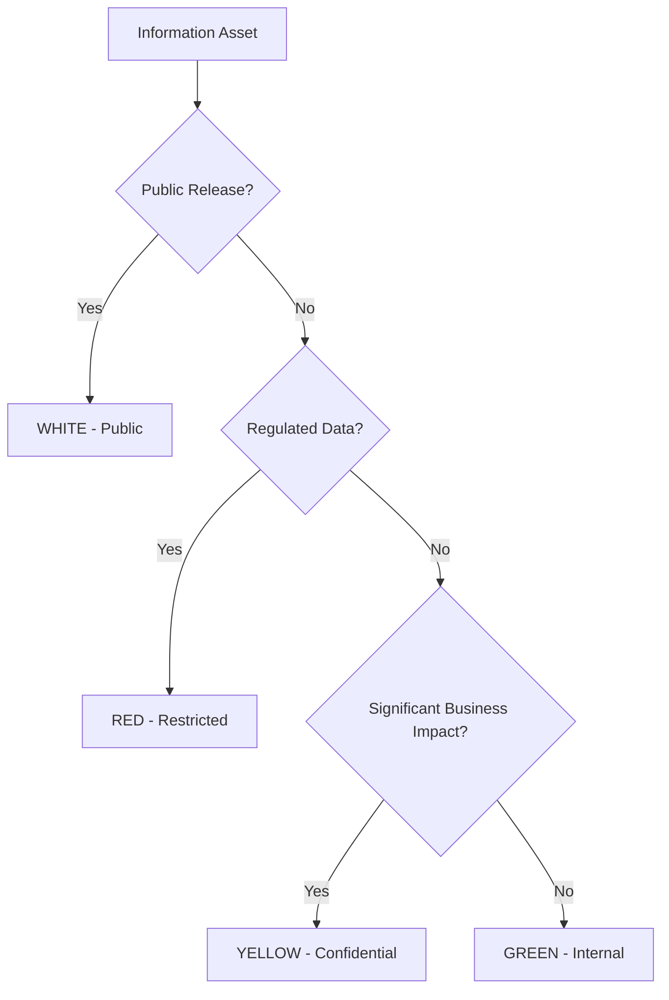

# Information Classification

## Overview

This document defines the information classification framework for the Intra365 platform, establishing clear guidelines for data handling, storage, and access based on sensitivity levels.

## Purpose

The Information Classification framework ensures:

- Consistent classification of information assets across the organization
- Appropriate security controls applied based on data sensitivity
- Compliance with regulatory requirements (GDPR, SOC 2, ISO 27001)
- Clear guidance for employees on data handling requirements

## Related Controls

- **ISO 27001:2022**: A.5.12, A.5.13, A.8.10, A.8.11, A.8.12
- **SOC 2**: CC6.1, CC6.7
- **GDPR**: Articles 5, 25, 32
- **Related Documents**:
  - [Network Access Control Model](./124-network-access-control-model.md)
  - [Data Leakage Prevention](./81-data-leakage-prevention.md)
  - [Information Backup](./82-information-backup.md)
  - [Cryptography](./93-cryptography.md)

---

## Information Classification Levels

### Classification Matrix

| Classification Level | Color Code | Description | Examples | Regulatory Impact |
|---------------------|------------|-------------|----------|------------------|
| **Public** | 🟦 White | Information intended for public consumption | Marketing materials, public website content, press releases | None |
| **Internal** | 🟢 Green | Internal business information not for external distribution | Internal memos, project plans, meeting notes | Low |
| **Confidential** | 🟡 Yellow | Sensitive business information requiring protection | Financial data, customer lists, contracts, strategic plans | Medium |
| **Restricted** | 🔴 Red | Highly sensitive/regulated data with maximum security | PII, payment data, authentication credentials, encryption keys | High |

### Classification Definitions

#### 🟦 White (Public)

**Definition**: Information that is intentionally made available to the public or would cause no harm if disclosed.

**Characteristics**:

- No confidentiality requirements
- Publicly accessible or intended for public release
- No regulatory restrictions
- Can be freely shared externally

**Examples**:

- Public website content
- Marketing and promotional materials
- Press releases and public announcements
- Published documentation and guides
- Public API documentation
- Job postings

#### 🟢 Green (Internal)

**Definition**: Information intended for internal use only but would cause minimal harm if disclosed.

**Characteristics**:

- For internal organizational use
- Not intended for external distribution
- Minimal business impact if disclosed
- May include operational information

**Examples**:

- Internal communications and memos
- General project documentation
- Internal process documentation
- Non-sensitive meeting notes
- Internal training materials
- Organizational charts

#### 🟡 Yellow (Confidential)

**Definition**: Sensitive business information that must be protected and could cause significant harm if disclosed.

**Characteristics**:

- Requires protection from unauthorized disclosure
- Significant business impact if compromised
- May be subject to contractual obligations
- Access on need-to-know basis

**Examples**:

- Financial reports and projections
- Customer information and contracts
- Strategic plans and roadmaps
- Source code and intellectual property
- Employee personal information
- Vendor contracts and negotiations
- Security assessments and audit reports

#### 🔴 Red (Restricted)

**Definition**: Highly sensitive or regulated data requiring maximum security controls.

**Characteristics**:

- Highest level of protection required
- Severe consequences if disclosed
- Subject to regulatory compliance requirements
- Strictly limited access
- May include legal or contractual restrictions

**Examples**:

- Payment card information (PCI-DSS)
- Authentication credentials and API keys
- Encryption keys and certificates
- Personal health information (HIPAA)
- Social security numbers and government IDs
- Biometric data
- Customer financial account information
- Trade secrets and proprietary algorithms

---

## Role-Based Information Access Matrix

### Access Rights by Role and Classification

| Role | White (Public) | Green (Internal) | Yellow (Confidential) | Red (Restricted) |
|------|----------------|------------------|----------------------|------------------|
| **Employee** | ✓ Unrestricted | ✓ Standard access | ✓ Job-related only | ✗ Special authorization |
| **Contractor** | ✓ Unrestricted | ✓ Project-related | ✓ Explicit approval | ✗ Prohibited |
| **Affiliated Company User** | ✓ Unrestricted | ✓ Partnership scope | ✗ Case-by-case | ✗ Prohibited |
| **Business Partner** | ✓ Unrestricted | ✓ Shared projects | ✗ Special agreements | ✗ Prohibited |
| **Customer** | ✓ Unrestricted | ✗ Prohibited | ✗ Prohibited | ✗ Prohibited |
| **External** | ✓ Public only | ✗ Prohibited | ✗ Prohibited | ✗ Prohibited |

### Access Control Requirements

| Classification | Authentication | Authorization | Audit Logging | Data Masking |
|---------------|----------------|---------------|---------------|--------------|
| **White (Public)** | Optional | None | Basic | No |
| **Green (Internal)** | ✓ Required | Employee+ | Standard | No |
| **Yellow (Confidential)** | ✓ MFA Required | Need-to-know | Enhanced | Sensitive fields |
| **Red (Restricted)** | ✓ Strong MFA | Authorized only | Comprehensive | All fields |

---

## Information Handling Requirements

### Security Controls by Classification

| Control Type | White (Public) | Green (Internal) | Yellow (Confidential) | Red (Restricted) |
|-------------|----------------|------------------|----------------------|------------------|
| **Encryption in Transit** | Optional | Recommended | ✓ Required (TLS 1.3) | ✓ Required (TLS 1.3 + mTLS) |
| **Encryption at Rest** | Optional | Recommended | ✓ Required (AES-256) | ✓ Required (AES-256 + HSM) |
| **Access Logging** | Optional | Basic | ✓ Detailed | ✓ Comprehensive + Real-time alerts |
| **Data Loss Prevention** | No | Basic | ✓ Required | ✓ Advanced + Watermarking |
| **Backup Requirements** | Standard | Standard | ✓ Encrypted backups | ✓ Encrypted + Air-gapped backups |
| **Multi-Factor Authentication** | No | Recommended | ✓ Required | ✓ Strong MFA (Hardware token) |
| **Network Segmentation** | No | No | Recommended | ✓ Required (Secure zone) |
| **Data Masking** | No | No | Sensitive fields | ✓ All fields in non-prod |

### Storage and Transmission Requirements

| Classification | Storage Location | Transmission Method | Sharing Restrictions |
|---------------|------------------|-------------------|---------------------|
| **White (Public)** | Any approved location | Any method | None |
| **Green (Internal)** | Corporate storage only | Encrypted channels | Internal only |
| **Yellow (Confidential)** | Approved secure storage | Encrypted + authenticated | Need-to-know only |
| **Red (Restricted)** | Secure zone only | Encrypted + mTLS | Authorized personnel only |

### Data Lifecycle Management

| Classification | Retention Period | Disposal Requirements | Archival Requirements |
|---------------|------------------|---------------------|----------------------|
| **White (Public)** | As needed | Standard deletion | Optional |
| **Green (Internal)** | 7 years (default) | Secure deletion | Standard backup |
| **Yellow (Confidential)** | Per policy/regulation | ✓ Certified destruction | ✓ Encrypted archive |
| **Red (Restricted)** | Per regulation | ✓ DoD 5220.22-M compliant | ✓ Encrypted + Air-gapped |

---

## Copy, Print, and Download Controls

### Document Handling Controls

| Classification | Copy/Paste | Print | Download | Screenshot | Mobile Access | Watermarking |
|---------------|-----------|-------|----------|------------|---------------|--------------|
| **White (Public)** | ✓ Allowed | ✓ Allowed | ✓ Allowed | ✓ Allowed | ✓ Allowed | No |
| **Green (Internal)** | ✓ Allowed | ✓ Logged | ✓ Allowed | ✓ Allowed | ✓ Managed devices | Recommended |
| **Yellow (Confidential)** | ✓ Logged | ✓ Logged + approval | ✓ Logged | ✓ Blocked | ✓ Corporate only | ✓ Required |
| **Red (Restricted)** | ✗ Blocked | ✗ Prohibited | ✗ Blocked | ✗ Blocked | ✗ Prohibited | ✓ Required + Dynamic |

### Email and Messaging Controls

| Classification | Email Attachment | External Email | Messaging Apps | Encryption Required |
|---------------|------------------|---------------|----------------|-------------------|
| **White (Public)** | ✓ Allowed | ✓ Allowed | ✓ Allowed | No |
| **Green (Internal)** | ✓ Internal only | ✗ Blocked | ✓ Corporate apps | Recommended |
| **Yellow (Confidential)** | ✓ Encrypted | ✓ Encrypted + approved | ✓ Encrypted channels | ✓ Required |
| **Red (Restricted)** | ✗ Prohibited | ✗ Prohibited | ✗ Prohibited | N/A (not allowed) |

---

## API and Database Access Controls

### API Access by Classification

| API Endpoint Category | White (Public) | Green (Internal) | Yellow (Confidential) | Red (Restricted) |
|----------------------|----------------|------------------|----------------------|------------------|
| **Read Operations** | ✓ Unrestricted | Employee+ | Need-to-know | Special authorization |
| **Write Operations** | Limited | Employee+ | Authorized roles | Highly restricted |
| **Bulk Operations** | Rate limited | Employee+ | Manager approval | C-level approval |
| **Admin Operations** | ✗ Prohibited | Admin roles | Senior admin | System admin only |
| **Reporting APIs** | Basic metrics | Standard reports | Sensitive reports | Executive reports |
| **Integration APIs** | Public services | Internal systems | Secure integrations | Critical systems |

### Database Access Controls

| Classification | Query Limits | Export Limits | Row-Level Security | Column Encryption |
|---------------|--------------|---------------|-------------------|------------------|
| **White (Public)** | None | Unlimited | No | No |
| **Green (Internal)** | 10,000 rows/query | 50,000 rows/day | Optional | No |
| **Yellow (Confidential)** | 5,000 rows/query | 10,000 rows/day | ✓ Required | Sensitive columns |
| **Red (Restricted)** | 1,000 rows/query | Logged only | ✓ Required + Audit | ✓ All columns |

---

## Classification Process

### How to Classify Information

1. **Identify the Information**
   - Determine what data or information needs classification
   - Consider all forms: documents, databases, communications, code

2. **Assess Sensitivity**
   - What harm could result from unauthorized disclosure?
   - Are there regulatory requirements (GDPR, PCI-DSS, HIPAA)?
   - Are there contractual obligations?
   - What is the business impact?

3. **Apply Classification**
   - Use the classification matrix to determine appropriate level
   - When in doubt, classify higher
   - Document classification decision

4. **Mark and Label**
   - Apply classification labels to documents
   - Use metadata tags for digital assets
   - Include classification in headers/footers

5. **Apply Controls**
   - Implement required security controls
   - Configure access permissions
   - Enable monitoring and logging

### Classification Decision Tree



### Reclassification

Information classification may change over time:

- **Upward Reclassification**: When information becomes more sensitive (requires approval)
- **Downward Reclassification**: When sensitivity decreases (requires approval + review)
- **Review Triggers**:
  - Business changes
  - Regulatory changes
  - Contractual changes
  - Security incidents
  - Annual classification review

---

## Intra365-Specific Implementation

### Azure Implementation

**Classification Tags**:

```yaml
# Azure Resource Tags
tags:
  DataClassification: "Confidential"
  Sensitivity: "Yellow"
  ComplianceScope: "SOC2,GDPR"
  Owner: "data-owner@intra365.com"
```

**Storage Account Configuration**:

```yaml
# White (Public) Storage
storage_account_public:
  tier: Standard
  replication: LRS
  encryption: Optional
  public_access: Allowed

# Red (Restricted) Storage
storage_account_restricted:
  tier: Premium
  replication: GRS
  encryption: Required (CMK)
  public_access: Denied
  network: Private endpoint only
  soft_delete: 90 days
```

### Database Implementation

**PostgreSQL Row-Level Security**:

```sql
-- Example RLS policy for Confidential data
CREATE POLICY confidential_access ON customer_data
  FOR SELECT
  USING (
    current_user_has_role('confidential_reader')
    OR owner_id = current_user_id()
  );

-- Example column encryption for Restricted data
CREATE TABLE sensitive_data (
  id UUID PRIMARY KEY,
  public_info TEXT,
  confidential_info TEXT,
  restricted_info BYTEA -- Encrypted with pgcrypto
);
```

### Kubernetes Implementation

**Pod Security for Different Classifications**:

```yaml
# Red (Restricted) Pod Security
apiVersion: v1
kind: Pod
metadata:
  name: restricted-service
  labels:
    data-classification: restricted
spec:
  securityContext:
    runAsNonRoot: true
    seccompProfile:
      type: RuntimeDefault
  containers:
  - name: app
    securityContext:
      allowPrivilegeEscalation: false
      readOnlyRootFilesystem: true
      capabilities:
        drop: ["ALL"]
```

### API Gateway Classification

**Azure API Management Policies**:

```xml
<policies>
  <inbound>
    <!-- Confidential APIs require MFA -->
    <validate-jwt header-name="Authorization" 
                  require-expiration-time="true"
                  require-mfa="true"/>
    
    <!-- Rate limiting based on classification -->
    <rate-limit calls="100" renewal-period="60"/>
    
    <!-- Add classification header -->
    <set-header name="X-Data-Classification" exists-action="override">
      <value>Confidential</value>
    </set-header>
  </inbound>
</policies>
```

---

## Compliance and Regulatory Mapping

### Regulatory Requirements by Classification

| Regulation | White | Green | Yellow | Red |
|-----------|-------|-------|--------|-----|
| **GDPR** | No | Basic | ✓ Required | ✓ Strict requirements |
| **PCI-DSS** | No | No | Payment-related only | ✓ Cardholder data |
| **HIPAA** | No | No | Healthcare-related | ✓ PHI |
| **SOC 2** | No | Basic | ✓ Required | ✓ Strict controls |
| **ISO 27001** | No | Basic | ✓ Required | ✓ Maximum controls |
| **CCPA** | No | CA residents | ✓ CA residents | ✓ Sensitive personal info |

### Data Residency Requirements

| Classification | Data Residency | Cross-Border Transfer | Sovereignty Requirements |
|---------------|----------------|----------------------|------------------------|
| **White (Public)** | Any region | Allowed | None |
| **Green (Internal)** | Preferred region | Allowed | None |
| **Yellow (Confidential)** | Specified regions | Encrypted + logged | Customer-specific |
| **Red (Restricted)** | Strict requirements | Prohibited/Heavily restricted | ✓ Mandatory compliance |

---

## Training and Awareness

### Classification Training Requirements

| Role | Training Type | Frequency | Certification Required |
|------|--------------|-----------|----------------------|
| **All Employees** | Basic classification awareness | Annual | Yes |
| **Developers** | Secure coding + classification | Semi-annual | Yes |
| **Data Owners** | Data stewardship + classification | Annual | Yes |
| **System Admins** | Classification controls implementation | Semi-annual | Yes |
| **Security Team** | Advanced classification management | Quarterly | Yes |

### Awareness Program

**Training Modules**:

1. Introduction to Information Classification
2. Classification Decision-Making
3. Handling Requirements by Classification
4. Incident Reporting and Classification Violations
5. Role-Specific Classification Responsibilities

**Communication**:

- New employee onboarding includes classification training
- Quarterly security newsletters with classification reminders
- Intranet portal with classification guidelines and examples
- Visual reminders (posters, screensavers)

---

## Monitoring and Compliance

### Classification Compliance Metrics

| Metric | Target | Measurement | Frequency |
|--------|--------|-------------|-----------|
| **Classified Assets** | 100% of sensitive data | Asset inventory scan | Weekly |
| **Proper Labeling** | >95% | Automated scanning | Daily |
| **Access Violations** | 0 | SIEM alerts | Real-time |
| **Training Completion** | 100% | LMS reports | Monthly |
| **Audit Findings** | 0 open | Audit reports | Quarterly |
| **Reclassification Reviews** | 100% on schedule | Review logs | Quarterly |

### Automated Compliance Checks

**Daily Checks**:

- Scan for unclassified sensitive data
- Verify encryption compliance
- Check access control configurations
- Monitor classification changes

**Weekly Reports**:

- Classification compliance dashboard
- Access violation summary
- Encryption status report
- Training completion status

**Monthly Reviews**:

- Classification accuracy review
- Control effectiveness assessment
- Incident analysis (classification-related)
- Trend analysis and improvement recommendations

---

## Incident Response

### Classification-Related Incidents

| Incident Type | Severity | Response Action | Notification Timeline |
|--------------|----------|-----------------|---------------------|
| **Public exposure of White** | Low | Document and review | Within 1 week |
| **External disclosure of Green** | Medium | Investigation + remediation | Within 24 hours |
| **Unauthorized access to Yellow** | High | Immediate investigation | Within 4 hours |
| **Breach of Red data** | Critical | Full incident response | Immediate |

### Data Breach Response by Classification

**Confidential (Yellow) Breach**:

1. Immediate containment
2. Assess scope and impact
3. Notify affected parties within 72 hours
4. Document and investigate
5. Implement remediation
6. Review and improve controls

**Restricted (Red) Breach**:

1. Immediate isolation and containment
2. Activate incident response team
3. Preserve forensic evidence
4. Notify regulatory authorities (within GDPR 72-hour requirement)
5. Notify affected individuals
6. Full root cause analysis
7. Comprehensive remediation and control enhancement

---

## Responsibilities

### Data Roles and Responsibilities

| Role | Responsibilities |
|------|-----------------|
| **Data Owner** | Classify data, approve access, ensure compliance |
| **Data Custodian** | Implement controls, maintain security, backup data |
| **Data User** | Follow handling requirements, report incidents |
| **CISO** | Overall classification program oversight |
| **Security Team** | Monitor compliance, respond to incidents |
| **Compliance Team** | Audit compliance, regulatory reporting |

### RACI Matrix

| Activity | Data Owner | Data Custodian | Data User | CISO | Security Team |
|----------|-----------|---------------|-----------|------|--------------|
| **Classify Information** | R/A | C | I | I | C |
| **Apply Controls** | A | R | I | I | C |
| **Access Review** | A/R | C | I | I | R |
| **Incident Response** | C | R | R | A | R |
| **Compliance Audit** | C | C | I | A | R |

---

## References

- ISO/IEC 27001:2022 - Information security management systems
- ISO/IEC 27002:2022 - Code of practice for information security controls
- NIST SP 800-60 - Guide for Mapping Types of Information and Information Systems to Security Categories
- [Network Access Control Model](./124-network-access-control-model.md)
- Intra365 Data Classification Policy
- Intra365 Data Handling Procedures

---

**Document Version**: 1.0  
**Last Updated**: November 11, 2025  
**Next Review Date**: February 11, 2026  
**Owner**: Chief Information Security Officer (CISO)  
**Classification**: Internal Use

---

**Questions or feedback?** [Open an issue](https://github.com/intra365/chef/issues) or [start a discussion](https://github.com/intra365/chef/discussions).
