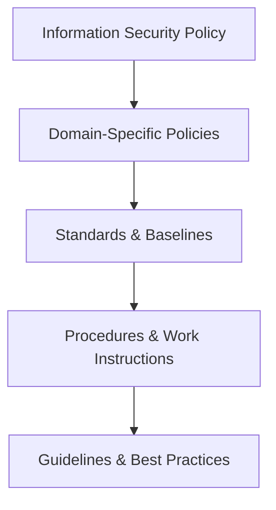
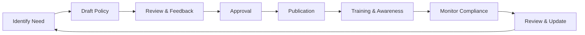

# Security Policy Framework

## Overview

The Security Policy Framework establishes the governance structure for information security at Intra365. It defines the hierarchy of security policies, standards, procedures, and guidelines that guide security decision-making and implementation.

## Policy Hierarchy



### Level 1: Information Security Policy (Master Policy)

The top-level policy that:
- States management's commitment to information security
- Defines security objectives and principles
- Establishes governance structure and accountability
- Sets overall direction for security program
- Applies to all Intra365 operations and personnel

**Approval**: Executive Management / Board  
**Review Frequency**: Annually

### Level 2: Domain-Specific Policies

Focused policies for specific security domains:
- Access Control Policy
- Data Classification and Handling Policy
- Acceptable Use Policy
- Incident Response Policy
- Business Continuity Policy
- Third-Party Security Policy
- Cloud Security Policy
- Remote Work Policy
- Cryptography Policy
- Change Management Policy

**Approval**: CISO with Executive Management concurrence  
**Review Frequency**: Annually or when significant changes occur

### Level 3: Standards and Baselines

Technical requirements and minimum security baselines:
- Password and Authentication Standards
- Encryption Standards
- Network Security Standards
- Logging and Monitoring Standards
- Secure Configuration Baselines
- Vulnerability Management Standards
- Backup and Recovery Standards

**Approval**: CISO  
**Review Frequency**: Semi-annually or as technology evolves

### Level 4: Procedures and Work Instructions

Step-by-step instructions for implementing policies:
- User Access Provisioning Procedure
- Incident Response Procedure
- Vulnerability Management Procedure
- Patch Management Procedure
- Backup and Restore Procedure
- Security Event Investigation Procedure

**Approval**: Department Heads  
**Review Frequency**: Quarterly or as processes change

### Level 5: Guidelines and Best Practices

Recommended practices and guidance:
- Secure Coding Guidelines
- Security Architecture Guidelines
- Cloud Configuration Recommendations
- Privacy by Design Guidelines
- Security Testing Guidelines

**Approval**: Security Team  
**Review Frequency**: As needed

## Master Information Security Policy

### Purpose

To protect Intra365 information assets from threats, whether internal or external, deliberate or accidental.

### Scope

This policy applies to:
- All Intra365 employees, contractors, and temporary staff
- All information systems, networks, and data
- All physical locations where Intra365 operates
- All third-party service providers with access to Intra365 systems or data

### Policy Statement

Intra365 is committed to:
- Protecting the confidentiality, integrity, and availability of information
- Complying with legal, regulatory, and contractual obligations
- Maintaining customer and stakeholder trust
- Implementing appropriate security controls based on risk
- Promoting security awareness and responsible behavior
- Continuously improving our security posture

### Guiding Principles

1. **Security by Design**: Security considerations integrated from the start
2. **Defense in Depth**: Multiple layers of security controls
3. **Least Privilege**: Minimum necessary access for job functions
4. **Zero Trust**: Never trust, always verify
5. **Transparency**: Open communication about security matters
6. **Accountability**: Clear ownership and responsibility
7. **Continuous Improvement**: Regular review and enhancement

### Responsibilities

#### Executive Management
- Provide strategic direction and resources for security program
- Approve master security policy and major security initiatives
- Review security performance and metrics
- Ensure compliance with legal and regulatory requirements

#### Chief Information Security Officer (CISO)
- Develop and maintain security policies and standards
- Oversee implementation of security controls
- Manage security incidents and breaches
- Report security status to executive management
- Coordinate security awareness and training

#### All Employees
- Comply with security policies and procedures
- Protect company and customer information
- Report security incidents and concerns
- Complete required security training
- Use security tools and controls properly

### Compliance and Enforcement

- Violations of this policy may result in disciplinary action
- Serious breaches may result in termination
- Criminal activities will be reported to authorities
- Regular audits verify compliance with policies

### Policy Review

- Reviewed annually or when significant changes occur
- Updated to reflect changes in business, technology, or threats
- All changes require executive management approval
- Staff notified of policy changes through formal communication

## Key Domain Policies

### Access Control Policy

**Objective**: Ensure only authorized users access Intra365 systems and data

**Key Requirements**:
- User authentication through approved mechanisms (SSO, MFA)
- Role-based access control (RBAC) based on job functions
- Regular access reviews and certifications
- Immediate revocation upon termination or role change
- Privileged access management with additional controls
- Remote access through approved secure channels only

**Related Standards**:
- [Privileged Access Rights](privileged-access-rights)
- [Secure Authentication](secure-authentication)
- [Information Access Restriction](information-access-restriction)

### Data Classification and Handling Policy

**Objective**: Ensure appropriate protection based on data sensitivity

**Classification Levels**:
- **Public**: No confidentiality requirement (marketing materials, public documents)
- **Internal**: Internal use only (internal procedures, non-sensitive business data)
- **Confidential**: Sensitive business information (contracts, financial data, employee data)
- **Restricted**: Highly sensitive information (customer PII, trade secrets, security data)

**Handling Requirements**:
- Encryption for Confidential and Restricted data
- Access controls appropriate to classification level
- Secure disposal when no longer needed
- Data loss prevention (DLP) controls for Restricted data

**Related Standards**:
- [Data Masking](data-masking)
- [Data Leakage Prevention](data-leakage-prevention)
- [Information Deletion](information-deletion)

### Acceptable Use Policy

**Objective**: Define appropriate use of Intra365 systems and resources

**Acceptable Uses**:
- Business purposes directly related to job functions
- Limited personal use if it doesn't interfere with work
- Professional communication and collaboration

**Prohibited Activities**:
- Unauthorized access or privilege escalation
- Installation of unauthorized software
- Sharing credentials or access with others
- Circumventing security controls
- Using systems for illegal activities
- Storing offensive or inappropriate content
- Excessive personal use impacting productivity

**Monitoring and Privacy**:
- Intra365 reserves the right to monitor system use
- No expectation of privacy on company systems
- Monitoring complies with applicable privacy laws

### Incident Response Policy

**Objective**: Ensure effective response to security incidents

**Key Requirements**:
- All suspected incidents must be reported immediately
- Incident response team activated for significant incidents
- Documented incident response procedures followed
- Evidence preservation for investigation and legal purposes
- Root cause analysis and lessons learned for all incidents
- Communication plan for internal and external stakeholders

**Incident Severity Levels**:
- **Critical**: Major breach, widespread impact, executive notification
- **High**: Significant incident, limited scope, management notification
- **Medium**: Moderate incident, contained impact
- **Low**: Minor incident, minimal impact

**Related Standards**:
- [Incident Management](incident-management)
- [Event Reporting](event-reporting)

### Cloud Security Policy

**Objective**: Secure use of cloud services and infrastructure

**Key Requirements**:
- All cloud services must be approved and assessed for security
- Shared responsibility model understood and documented
- Cloud configuration aligned with security baselines
- Data sovereignty and residency requirements met
- Regular reviews of cloud security posture
- Cloud access management through centralized identity provider

**Related Standards**:
- [Cloud Services Security](cloud-services-security)
- [Network Security](networks-security)

### Cryptography Policy

**Objective**: Protect data through appropriate cryptographic controls

**Key Requirements**:
- Encryption for data at rest (Confidential and Restricted data)
- Encryption for data in transit (all sensitive communications)
- Approved cryptographic algorithms and key lengths
- Secure key management practices
- Certificate management and rotation
- Compliance with export controls and regulations

**Approved Standards**:
- **Encryption**: AES-256 (at rest), TLS 1.2+ (in transit)
- **Hashing**: SHA-256 or better
- **Key Exchange**: Diffie-Hellman, ECDHE
- **Digital Signatures**: RSA 2048-bit+, ECDSA

**Related Standards**:
- [Use of Cryptography](cryptography)

### Change Management Policy

**Objective**: Manage changes to prevent security incidents

**Key Requirements**:
- All changes require approval before implementation
- Security review for changes affecting production systems
- Testing in non-production environments first
- Documented rollback plans for all changes
- Emergency change process for urgent security fixes
- Post-implementation review and documentation

**Related Standards**:
- [Change Management](change-management)
- [Separation of Environments](separation-environments)

### Third-Party Security Policy

**Objective**: Manage risks from third-party relationships

**Key Requirements**:
- Security assessment before engaging third parties
- Security requirements in all contracts
- Regular security reviews of critical suppliers
- Incident notification and response requirements
- Right to audit third-party security controls
- Secure data sharing and access management

**Related Standards**:
- [Supplier Relationships](supplier-relationships)
- [Cloud Services Security](cloud-services-security)

### Remote Work Policy

**Objective**: Enable secure remote work practices

**Key Requirements**:
- VPN required for accessing internal systems
- Encrypted storage on all endpoints
- Screen lock after inactivity
- Secure home network (WPA2/WPA3)
- No storage of sensitive data on personal devices
- Clear desk and clear screen practices
- Physical security of equipment at home

**Related Standards**:
- [Remote Working](remote-working)
- [User Endpoint Devices](user-endpoint-devices)

## Policy Development Process

### Policy Lifecycle



### Policy Creation

1. **Identify Need**: Gap analysis, regulatory requirement, risk assessment
2. **Assign Owner**: CISO assigns policy owner (domain expert)
3. **Research**: Review best practices, peer policies, legal requirements
4. **Draft**: Create policy using standard template
5. **Stakeholder Review**: Circulate to affected parties for feedback
6. **Legal Review**: Ensure legal and compliance review
7. **Revise**: Incorporate feedback and finalize
8. **Approval**: Submit to appropriate authority for approval

### Policy Review and Update

- **Scheduled Review**: All policies reviewed at defined intervals
- **Triggered Review**: When significant changes occur:
  - New regulations or legal requirements
  - Major security incidents
  - Technology changes
  - Business process changes
  - Audit findings
  
### Version Control

- All policies maintained under version control
- Version history tracked with changes documented
- Previous versions archived for reference
- Change log maintained showing updates and rationale

## Policy Communication and Training

### Communication Strategy

#### New Policies
- Formal announcement through multiple channels (email, intranet, town halls)
- Summary of key requirements and impacts
- Implementation timeline
- Training availability
- Contact for questions

#### Policy Updates
- Change notification with summary of updates
- Rationale for changes
- Effective date
- Training if significant changes

### Training and Awareness

- **New Employee Onboarding**: Introduction to key policies
- **Annual Training**: Refresher on critical policies
- **Role-Specific Training**: Targeted training for specific roles
- **Just-in-Time Training**: Training when new policies released
- **Ongoing Awareness**: Regular communications, tips, reminders

### Policy Acknowledgment

- Employees acknowledge receipt and understanding
- Acknowledgments tracked and monitored
- Periodic re-acknowledgment for critical policies
- Non-compliance followed up with management

## Policy Enforcement and Compliance

### Monitoring and Auditing

- **Automated Monitoring**: Technical controls enforce policy compliance
- **Regular Audits**: Periodic reviews of policy compliance
- **Access Reviews**: Regular certification of access rights
- **Incident Analysis**: Review incidents for policy violations
- **Metrics and Reporting**: Compliance metrics tracked and reported

### Non-Compliance Handling

#### Investigation Process
1. Incident reported or detected
2. Preliminary investigation by security team
3. Determine if policy violation occurred
4. Assess severity and impact
5. Document findings

#### Disciplinary Actions

| Severity | First Offense | Second Offense | Third Offense |
|----------|---------------|----------------|---------------|
| **Minor** | Verbal warning | Written warning | Formal reprimand |
| **Moderate** | Written warning | Formal reprimand | Suspension |
| **Serious** | Suspension | Termination | Termination |
| **Critical** | Termination | Termination | Termination |

- Criminal activities reported to law enforcement
- Documentation of all disciplinary actions
- HR involved in all personnel actions

## Policy Governance

### Policy Ownership

| Policy Area | Owner | Approver |
|-------------|-------|----------|
| **Master Security Policy** | CISO | Executive Management |
| **Access Control** | CISO | CISO |
| **Data Protection** | CISO | CISO |
| **HR Security** | HR Director | CISO |
| **Physical Security** | Facilities Manager | CISO |
| **Development Security** | CTO | CISO |
| **Operations Security** | Operations Manager | CISO |

### Security Policy Committee

- **Composition**: CISO, CTO, Legal, HR, Operations, Compliance
- **Frequency**: Quarterly
- **Responsibilities**:
  - Review policy effectiveness
  - Approve new policies and major updates
  - Address policy conflicts or gaps
  - Oversee policy compliance program

### Integration with ISMS

Policies support ISO 27001 requirements:
- **Clause 5.2**: Information security policy
- **Annex A.5.1**: Policies for information security
- **Various Controls**: Specific policies support control implementation

## Policy Documentation Standards

### Policy Template

All policies follow a standard template:

```
1. Purpose
2. Scope
3. Policy Statement
4. Definitions
5. Responsibilities
6. Requirements (detailed policy rules)
7. Exceptions Process
8. Enforcement
9. Related Documents
10. Approval and Review
```

### Documentation Requirements

- **Clear Language**: Avoid jargon, use plain language
- **Measurable**: Requirements should be verifiable
- **Actionable**: Clear guidance on what to do
- **Accessible**: Published in central repository
- **Searchable**: Indexed and tagged for easy discovery

### Policy Repository

- Central SharePoint/document management system
- Organized by category and domain
- Version-controlled
- Access-controlled (public vs. confidential policies)
- Search functionality
- Notification of updates

## Exception Management

### Exception Process

1. **Request**: Submit exception request with business justification
2. **Assessment**: Security team assesses risk
3. **Mitigation**: Identify compensating controls
4. **Approval**: CISO or appropriate authority approves
5. **Documentation**: Exception formally documented
6. **Monitoring**: Exception monitored for compliance
7. **Review**: Periodic review of exception validity
8. **Expiration**: Time-limited exceptions expire and require renewal

### Exception Tracking

- All exceptions tracked in central register
- Regular reviews ensure exceptions are still valid
- Expired exceptions automatically revoked
- Metrics on exception trends and patterns

## Compliance Verification

### Self-Assessments

- Departments conduct annual self-assessments
- Checklist-based review of policy compliance
- Results reported to CISO
- Action plans for identified gaps

### Internal Audits

- Risk-based audit plan
- Sample testing of policy compliance
- Interviews and documentation reviews
- Findings tracked to closure

### External Audits

- ISO 27001 certification audits
- Customer security audits
- Regulatory examinations
- Third-party assessments

## Metrics and Reporting

### Key Policy Metrics

- Policy compliance rate (% of compliant systems/users)
- Training completion rate
- Exception count and trends
- Policy violation incidents
- Time to policy update after trigger event
- Acknowledgment completion rate

### Reporting

- Monthly compliance dashboard
- Quarterly policy committee report
- Annual management review
- Ad-hoc reports for incidents or audits

## Related Documents

- [ISMS Framework](isms-framework)
- [Roles and Responsibilities](roles-responsibilities)
- [Management Responsibilities](management-responsibilities)
- [Information Security Policies](information-security-policies)
- [Compliance Checklist](compliance-checklist)

---

**Questions or feedback?** [Open an issue](https://github.com/intra365/chef/issues) or [start a discussion](https://github.com/intra365/chef/discussions).
