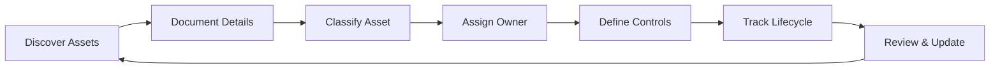
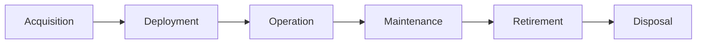

# Asset Management

## Overview

Asset management is the process of identifying, inventorying, classifying, and protecting information assets to ensure appropriate security controls are applied based on their value and sensitivity. This document defines the asset management approach for Intra365 in accordance with ISO 27001:2022 requirements.

## Objectives

- Identify and inventory all information assets
- Classify assets based on their value and sensitivity
- Assign ownership and accountability for assets
- Apply appropriate security controls based on classification
- Track assets throughout their lifecycle
- Enable effective risk management

## Asset Categories

### 1. Information Assets

#### Databases and Data Stores
- **Customer Databases**: User data, profiles, preferences
- **Configuration Databases**: System settings, parameters
- **Operational Databases**: Logs, metrics, monitoring data
- **Backup Data**: Database backups, snapshots

#### Documents and Files
- **Policies and Procedures**: Security policies, operational procedures
- **Contracts and Agreements**: Customer contracts, vendor agreements, NDAs
- **Design Documents**: Architecture diagrams, technical specifications
- **Business Documents**: Reports, presentations, financial data

#### Source Code and Intellectual Property
- **Application Code**: Intra365 service code
- **Infrastructure as Code**: Terraform, Kubernetes manifests, Helm charts
- **Scripts and Automation**: Deployment scripts, automation tools
- **Documentation**: Code comments, API documentation

#### Credentials and Secrets
- **Passwords and API Keys**: Service accounts, API tokens
- **Certificates**: TLS/SSL certificates, signing certificates
- **Encryption Keys**: Data encryption keys, key pairs
- **Access Tokens**: OAuth tokens, session tokens

### 2. Software Assets

#### Applications
- **Intra365 Services**: Core platform services
- **Third-Party Applications**: Monitoring tools, SIEM, collaboration tools
- **Mobile Applications**: Mobile apps if applicable
- **Web Applications**: Admin portals, customer portals

#### System Software
- **Operating Systems**: Linux distributions, container base images
- **Databases**: PostgreSQL, Redis, etc.
- **Middleware**: Web servers, application servers
- **Container Orchestration**: Kubernetes, Docker

#### Development and Testing Tools
- **IDEs and Development Tools**: VS Code, IntelliJ, etc.
- **CI/CD Tools**: GitHub Actions, Jenkins, ArgoCD
- **Testing Tools**: Unit test frameworks, integration test tools
- **Security Tools**: SAST, DAST, dependency scanners

### 3. Physical Assets

#### Hardware
- **Servers**: On-premises servers if any
- **Network Equipment**: Routers, switches, firewalls (if physical)
- **Storage Devices**: NAS, SAN (if applicable)

#### Endpoint Devices
- **Laptops**: Employee workstations
- **Desktop Computers**: Fixed workstations if any
- **Mobile Devices**: Smartphones, tablets
- **IoT Devices**: Smart office equipment

#### Storage Media
- **External Drives**: USB drives, external HDDs
- **Backup Media**: Backup tapes, if used
- **Portable Storage**: SD cards, other removable media

### 4. Cloud and Virtual Assets

#### Cloud Infrastructure
- **Virtual Machines**: Azure VMs if any
- **Containers**: Docker containers, Kubernetes pods
- **Serverless Functions**: Azure Functions, if used
- **Storage**: Azure Blob Storage, File Shares

#### Cloud Services
- **IaaS**: Azure compute, storage, networking
- **PaaS**: Azure App Service, Azure SQL, if used
- **SaaS**: Microsoft 365, Slack, monitoring services

#### Network Assets
- **Virtual Networks**: Azure VNets, subnets
- **Load Balancers**: Application gateways, load balancers
- **CDN**: Content delivery networks
- **DNS**: DNS zones and records

### 5. Services

#### Managed Services
- **Cloud Provider Services**: Azure services
- **Security Services**: SIEM, threat intelligence, managed detection
- **Backup Services**: Cloud backup solutions
- **Monitoring Services**: Application and infrastructure monitoring

#### Business Services
- **Email and Collaboration**: Microsoft 365, Slack
- **HR Systems**: HRIS, payroll systems
- **Financial Systems**: Accounting, invoicing
- **CRM**: Customer relationship management

### 6. Human Assets

#### Personnel
- **Employees**: Full-time employees
- **Contractors**: Contract workers, consultants
- **Interns**: Temporary staff
- **Vendors**: Third-party personnel with access

#### Knowledge and Expertise
- **Tribal Knowledge**: Undocumented expertise
- **Training Materials**: Security training content
- **Documentation**: Process documentation, runbooks

## Asset Identification and Inventory

### Asset Inventory Process

### Asset Discovery Methods

#### Automated Discovery
- **Network Scanning**: Discover networked devices and services
- **Cloud Asset Discovery**: Azure Resource Graph, inventory tools
- **Configuration Management**: Track assets via configuration management databases (CMDB)
- **Agent-Based**: Endpoint management agents report inventory

#### Manual Discovery
- **Surveys**: Department surveys to identify assets
- **Interviews**: Stakeholder interviews
- **Documentation Review**: Review existing documentation
- **Physical Inspections**: Walk-throughs of facilities

### Asset Inventory Contents

For each asset, document:

| Field | Description | Example |
|-------|-------------|---------|
| **Asset ID** | Unique identifier | AST-2025-001 |
| **Asset Name** | Descriptive name | Customer Database |
| **Asset Type** | Category | Database |
| **Classification** | Sensitivity level | Restricted |
| **Owner** | Primary responsible person | John Doe (CISO) |
| **Custodian** | Day-to-day manager | Jane Smith (DBA) |
| **Location** | Physical or logical location | Azure East US |
| **Description** | Detailed description | Primary customer data store |
| **Dependencies** | Related assets | Web App, API Service |
| **Value** | Business value | Critical |
| **Status** | Lifecycle status | In Production |
| **Acquired Date** | When acquired | 2024-01-15 |
| **Retired Date** | When retired (if applicable) | - |
| **Review Date** | Last inventory review | 2025-01-15 |

### Asset Inventory Tools

- **Cloud-Native Tools**: Azure Resource Graph, Azure Inventory
- **CMDB**: Configuration Management Database
- **Asset Management Software**: Dedicated asset tracking tools
- **Spreadsheets**: For small inventories or specific asset types
- **Integration**: Automatic updates from cloud provider APIs

## Asset Classification

### Classification Levels

| Level | Description | Examples | Security Controls |
|-------|-------------|----------|-------------------|
| **Public** | Information intended for public disclosure | Marketing materials, public documentation | Integrity controls |
| **Internal** | Internal use only, no external disclosure | Internal procedures, non-sensitive business data | Basic access controls |
| **Confidential** | Sensitive information, limited distribution | Contracts, employee data, financial reports | Encryption, strict access control |
| **Restricted** | Highly sensitive, strictly controlled | Customer PII, trade secrets, credentials | Strong encryption, MFA, DLP, auditing |

### Classification Criteria

#### Confidentiality Impact
- Public: No impact from disclosure
- Internal: Minor embarrassment or inefficiency
- Confidential: Significant competitive or reputational damage
- Restricted: Severe damage, legal liability, customer loss

#### Integrity Impact
- Public: Minimal (correctable through re-publication)
- Internal: Moderate (incorrect decisions, inefficiency)
- Confidential: Significant (financial loss, operational disruption)
- Restricted: Critical (safety issues, major financial loss)

#### Availability Impact
- Public: Low (delay in access acceptable)
- Internal: Moderate (some operational impact)
- Confidential: High (business operations affected)
- Restricted: Critical (severe business disruption)

### Classification Process

1. **Asset Owner** assigns initial classification
2. **Classification Criteria** applied (confidentiality, integrity, availability)
3. **Data Sensitivity** assessed (PII, financial, trade secrets)
4. **Regulatory Requirements** considered (GDPR, HIPAA, etc.)
5. **Business Impact** evaluated
6. **Classification Documented** in asset inventory
7. **Review** periodically or when circumstances change

### Classification Labeling

Assets should be labeled with their classification:
- **Documents**: Header/footer markings, watermarks
- **Data**: Metadata tags in databases
- **Files**: File properties or naming conventions
- **Systems**: Login banners, asset tags
- **Physical**: Labels on hardware, storage media

## Asset Ownership

### Roles and Responsibilities

#### Asset Owner
- **Accountable** for the asset
- Assigns classification level
- Approves access to the asset
- Determines security requirements
- Reviews and approves changes
- Decides on asset retention and disposal

**Typically**: Business unit leader, data owner

#### Asset Custodian
- **Responsible** for day-to-day management
- Implements security controls
- Performs backups and maintenance
- Manages access provisioning
- Monitors asset health and security
- Reports issues to owner

**Typically**: IT staff, system administrator, DBA

#### Asset Users
- Use assets in accordance with policies
- Protect assets from unauthorized access
- Report security issues or incidents
- Comply with acceptable use policies

**Typically**: Employees, contractors

### Ownership Assignment

- Owner assigned during asset identification
- Ownership documented in asset inventory
- Ownership communicated to relevant parties
- Ownership reviewed annually
- Ownership transferred during organizational changes

### Accountability

- Owners accountable for security of their assets
- Included in performance evaluations
- Required to participate in risk assessments
- Responsible for compliance with policies

## Asset Security Controls

### Control Selection Based on Classification

| Classification | Access Control | Encryption | Backup | Monitoring | DLP |
|----------------|----------------|------------|--------|-----------|-----|
| **Public** | Public read | Not required | Optional | Basic | No |
| **Internal** | Authenticated users | Optional | Standard | Standard | No |
| **Confidential** | Role-based (RBAC) | At rest & in transit | Daily | Enhanced | Yes |
| **Restricted** | Strict RBAC + MFA | Strong encryption | Multiple daily | Comprehensive | Yes |

### Technical Controls

#### Access Controls
- **Authentication**: SSO, MFA for sensitive assets
- **Authorization**: RBAC, least privilege
- **Access Reviews**: Periodic certification
- **Privileged Access**: Additional controls for admin access

See [Information Access Restriction](information-access-restriction)

#### Data Protection
- **Encryption**: AES-256 for data at rest, TLS 1.2+ for data in transit
- **Key Management**: Secure key storage and rotation
- **Data Masking**: For non-production environments
- **DLP**: Prevent unauthorized data exfiltration

See [Use of Cryptography](cryptography)

#### Monitoring and Logging
- **Logging**: Comprehensive logs for restricted assets
- **Monitoring**: Real-time alerting for security events
- **Audit Trails**: Detailed access and change logs
- **SIEM Integration**: Centralized log management

See [Logging](logging) and [Monitoring Activities](monitoring-activities)

### Administrative Controls

#### Policies and Procedures
- Asset management policy
- Data classification policy
- Acceptable use policy
- Asset disposal procedure

#### Training and Awareness
- Asset classification training
- Data handling training
- Role-specific security training

#### Documentation
- Asset inventory
- Classification scheme
- Control matrices
- Incident response procedures

### Physical Controls

#### Physical Assets
- Secure storage for sensitive equipment
- Asset tracking (barcodes, RFID)
- Environmental controls (temperature, humidity)
- Physical access controls

#### Media Handling
- Secure storage of backup media
- Encrypted storage media
- Secure transport procedures
- Secure disposal (wiping, destruction)

See [Storage Media](storage-media) and [Secure Disposal](secure-disposal)

## Asset Lifecycle Management

### Lifecycle Stages

### 1. Acquisition

- **Planning**: Define requirements, budget
- **Approval**: Obtain necessary approvals
- **Procurement**: Purchase or develop asset
- **Security Assessment**: Evaluate security posture
- **Inventory**: Add to asset inventory

**Security Considerations**:
- Evaluate vendor security
- Review contracts for security requirements
- Ensure compatibility with security standards

### 2. Deployment

- **Configuration**: Apply security baselines
- **Integration**: Integrate with existing systems
- **Testing**: Verify functionality and security
- **Documentation**: Update inventory and documentation
- **Training**: Train users on secure use

**Security Considerations**:
- Harden configurations
- Apply security patches
- Configure monitoring and logging
- Implement access controls

### 3. Operation

- **Use**: Normal business use of asset
- **Monitoring**: Ongoing security monitoring
- **Compliance**: Regular compliance checks
- **Access Management**: Manage user access
- **Performance**: Monitor performance and capacity

**Security Considerations**:
- Continuous monitoring
- Regular access reviews
- Vulnerability scanning
- Incident response

### 4. Maintenance

- **Patching**: Apply security updates
- **Updates**: Upgrade software/firmware
- **Repairs**: Fix issues and defects
- **Optimization**: Performance tuning
- **Reviews**: Periodic security reviews

**Security Considerations**:
- Test patches before deployment
- Maintain security during maintenance windows
- Document all changes
- Re-certify after major changes

### 5. Retirement

- **Planning**: Plan for asset replacement
- **Migration**: Move to new asset if needed
- **Decommission**: Remove from production
- **Archive**: Archive data if needed
- **Inventory Update**: Mark as retired

**Security Considerations**:
- Data migration security
- Access revocation
- Configuration removal from production
- Notification to stakeholders

### 6. Disposal

- **Data Sanitization**: Securely wipe or destroy data
- **Physical Disposal**: Shred, degauss, or certified destruction
- **Certificates**: Obtain certificates of destruction
- **Inventory Update**: Remove from inventory
- **Audit Trail**: Document disposal process

**Security Considerations**:
- Ensure complete data removal
- Comply with regulatory retention requirements
- Use certified disposal services
- Maintain disposal records

See [Secure Disposal](secure-disposal)

## Asset Inventory Maintenance

### Regular Reviews

| Frequency | Activity | Responsibility |
|-----------|----------|----------------|
| **Weekly** | New asset additions | IT / Operations |
| **Monthly** | Inventory accuracy check | Asset Custodians |
| **Quarterly** | Classification review | Asset Owners |
| **Annually** | Comprehensive inventory audit | CISO / Compliance |
| **Ad-hoc** | Major changes or incidents | Relevant Teams |

### Update Triggers

- New asset acquisition
- Asset retirement or disposal
- Classification changes
- Ownership changes
- Location changes
- Security incidents involving assets
- Audit findings

### Inventory Accuracy

- Regular reconciliation with actual assets
- Investigation of discrepancies
- Update of inventory records
- Removal of retired assets
- Verification of asset details

## Metrics and Reporting

### Asset Management KPIs

- **Inventory Completeness**: % of assets inventoried
- **Classification Compliance**: % of assets properly classified
- **Ownership Assignment**: % of assets with assigned owners
- **Review Currency**: % of assets reviewed within required timeframe
- **Control Compliance**: % of assets with required controls implemented
- **Disposal Compliance**: % of retired assets properly disposed

### Reporting

#### Management Dashboard
- Total asset count by type
- Classification distribution
- Compliance status
- High-value asset tracking
- Security control coverage

#### Detailed Reports
- Complete asset inventory
- Assets by owner
- Assets by classification
- Assets by location
- Assets nearing end-of-life
- Non-compliant assets

## Integration with Other Processes

### Risk Management
- Asset inventory feeds risk assessment
- Asset value determines risk impact
- Risk treatment affects asset controls

See [Risk Assessment Methodology](risk-assessment-methodology)

### Incident Management
- Asset inventory aids incident response
- Incident data updates asset risk profile
- Asset criticality determines incident priority

See [Incident Management](incident-management)

### Change Management
- Asset changes tracked through change management
- Change impact assessed on related assets
- Asset inventory updated post-change

See [Change Management](change-management)

### Compliance
- Asset inventory supports compliance audits
- Asset controls demonstrate compliance
- Inventory completeness is compliance requirement

See [Compliance Checklist](compliance-checklist)

## Tools and Technologies

### Asset Management Tools
- **Azure Resource Graph**: Cloud asset discovery and inventory
- **Microsoft Endpoint Manager**: Endpoint asset tracking
- **ServiceNow/Jira**: CMDB and asset tracking
- **Custom Scripts**: Automated inventory updates via APIs

### Integration Points
- **SIEM**: Security event correlation with assets
- **Vulnerability Management**: Link vulnerabilities to assets
- **Configuration Management**: Track asset configurations
- **Monitoring Tools**: Real-time asset status

## Compliance Requirements

### ISO 27001 Controls
- **A.5.9**: Inventory of information and other associated assets
- **A.5.10**: Acceptable use of information and other associated assets
- **A.8.10**: Information deletion
- Various controls requiring knowledge of assets

### Other Frameworks
- **RAISE 2.0**: Asset inventory and classification requirements
- **GDPR**: Data inventory for personal data processing
- **SOC 2**: Asset tracking for security and availability

## References

- [ISO/IEC 27001:2022 - Information Security Management Systems](https://www.iso.org/standard/27001) - International Organization for Standardization
- [ISO/IEC 27002:2022 - Information Security Controls](https://www.iso.org/standard/75652.html) - Control A.5.9 Inventory of assets
- [NIST SP 800-53 Rev. 5 - CM-8: System Component Inventory](https://csrc.nist.gov/publications/detail/sp/800-53/rev-5/final) - National Institute of Standards and Technology
- [CIS Controls v8 - Control 1: Inventory and Control of Enterprise Assets](https://www.cisecurity.org/controls/v8) - Center for Internet Security
- [Azure Resource Graph Documentation](https://learn.microsoft.com/en-us/azure/governance/resource-graph/) - Microsoft Azure
- [CMDB Best Practices](https://www.servicenow.com/products/it-operations-management/what-is-cmdb.html) - ServiceNow
- [ITIL Asset Management](https://www.axelos.com/certifications/itil-service-management) - AXELOS
- [GDPR Article 30 - Records of Processing Activities](https://gdpr-info.eu/art-30-gdpr/) - EU Regulation
- [Data Classification Guide](https://nvlpubs.nist.gov/nistpubs/Legacy/FIPS/fipspub199.pdf) - NIST FIPS 199
- [Secure Asset Disposal Guidelines](https://www.nist.gov/publications/guidelines-media-sanitization) - NIST SP 800-88

---

**Need help with asset management?** [Open an issue](https://github.com/intra365/chef/issues) or [start a discussion](https://github.com/intra365/chef/discussions)

## Related Documents

- [ISMS Framework](isms-framework)
- [Risk Assessment Methodology](risk-assessment-methodology)
- [Information Access Restriction](information-access-restriction)
- [Use of Cryptography](cryptography)
- [Change Management](change-management)
- [Secure Disposal](secure-disposal)

---

**Questions or feedback?** [Open an issue](https://github.com/intra365/chef/issues) or [start a discussion](https://github.com/intra365/chef/discussions).
