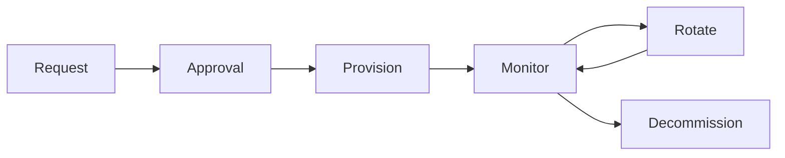

# Privileged Access Rights

## ISO 27001:2022 Control

**Control**: A.8.2 - Privileged access rights

## Overview

This document provides guidance for implementing and maintaining privileged access rights controls for the Intra365 platform in accordance with ISO 27001:2022 requirements.

## Control Objective

The objective of this control is to ensure appropriate security measures are in place to protect information assets and support business operations.

## Applicability

- **Status**: Applicable
- **Implementation Status**: In Progress
- **Owner**: CISO
- **Review Date**: Quarterly

## Control Requirements

### What Must Be Done

Privileged access rights must be controlled and managed according to ISO 27001:2022 requirements:

1. **Principle of Least Privilege**: Grant only the minimum access rights necessary for job functions
2. **Separation of Duties**: Separate privileged roles to prevent conflicts of interest
3. **Time-Limited Access**: Implement just-in-time (JIT) access for privileged operations
4. **Strong Authentication**: Require multi-factor authentication for all privileged access
5. **Comprehensive Logging**: Record all privileged activities for audit and investigation
6. **Regular Reviews**: Conduct periodic reviews of privileged access rights

### Privileged Account Types

| Account Type | Description | Access Method | Use Case |
|-------------|-------------|---------------|----------|
| **Domain Admin** | Full directory control | PAM vault + Strong MFA | Directory management, policy changes |
| **Database Admin** | Full database control | PAM vault + Strong MFA | Database management, schema changes |
| **Cloud Admin** | Cloud infrastructure control | PAM vault + Strong MFA | Azure/K8s resource management |
| **Security Admin** | Security system control | PAM vault + Hardware token | Security tool configuration, incident response |
| **Network Admin** | Network infrastructure control | PAM vault + Strong MFA | Network configuration, firewall rules |
| **Application Admin** | Application-level control | PAM vault + Strong MFA | Application configuration, deployment |
| **Service Account** | Automated system access | Vault API + Certificate | System-to-system authentication |

## Implementation Guidance

### For Intra365

Intra365 implements privileged access management through a comprehensive framework:

#### 1. Privileged Access Management (PAM) System

**Implementation**:

- **PAM Vault**: Azure Key Vault with Privileged Identity Management (PIM)
- **Session Recording**: All privileged sessions recorded and stored for 7 years
- **Password Rotation**: Automated rotation with the following frequencies:
  - Security Admin accounts: Every 15 days
  - Domain/Database/Cloud Admin: Every 30 days
  - Service accounts: Every 90 days
- **Access Approval**: Dual approval for high-privilege accounts

**Technical Details**:

```yaml
# Example Azure PIM Configuration
privileged_roles:
  - name: "AKS Cluster Admin"
    max_duration: 8h
    approval_required: true
    mfa_required: true
    justification_required: true

  - name: "Database Administrator"
    max_duration: 4h
    approval_required: true
    mfa_required: true
    session_recording: true
```

#### 2. Just-in-Time (JIT) Access

**Access Durations**:

| Resource Type | Maximum Session | Request Approval | Auto-Revocation |
|--------------|----------------|------------------|-----------------|
| **Production Servers** | 4 hours | Manager + Ops | ✓ Automatic |
| **Database Systems** | 2 hours | Manager + DBA | ✓ Automatic |
| **Cloud Resources** | 8 hours | Manager + Cloud team | ✓ Automatic |
| **Security Tools** | 4 hours | Security manager | ✓ Automatic |
| **Financial Systems** | 2 hours | Finance manager | ✓ Automatic |
| **Customer Data** | 1 hour | Privacy officer | ✓ Automatic |

**JIT Workflow**:

1. User submits access request with business justification
2. Request routed to appropriate approver(s)
3. Upon approval, temporary access provisioned automatically
4. User receives time-limited credentials
5. All activities logged and monitored
6. Access automatically revoked at session end

#### 3. Break-Glass Procedures

Emergency access for critical situations:

| Scenario | Access Method | Authorization | Time Limit | Notification | Post-Event Review |
|----------|--------------|---------------|------------|--------------|-------------------|
| **System Outage** | Emergency account | On-call manager | Incident duration | ✓ Immediate | ✓ Within 24h |
| **Security Incident** | Security vault | CISO/Deputy | Incident duration | ✓ Immediate | ✓ Within 48h |
| **Data Recovery** | Backup admin account | IT Director | 8 hours max | ✓ Immediate | ✓ Within 24h |
| **Disaster Recovery** | DR procedures | Exec approval | Event duration | ✓ Immediate | ✓ Post-DR |

**Break-Glass Implementation**:

- Sealed envelopes with emergency credentials stored in secure physical location
- Digital break-glass accounts stored in offline vault
- Automatic alerting on break-glass account usage
- Mandatory post-incident review within 24-48 hours

#### 4. Authentication Requirements

All privileged accounts require:

- **Multi-Factor Authentication**: Hardware token (YubiKey) or authenticator app
- **Certificate-Based Authentication**: For service accounts and automated processes
- **Risk-Based Authentication**: Additional challenges based on context (location, device, behavior)
- **Session Timeout**: Automatic logout after inactivity:
  - Security Admin: 15 minutes
  - Database/Cloud Admin: 30 minutes
  - Application Admin: 1 hour

#### 5. Monitoring and Alerting

**Privileged Activity Monitoring**:

- Real-time monitoring of all privileged access
- Automated alerts for:
  - Unusual access patterns
  - After-hours privileged access
  - Failed authentication attempts (threshold: 3 failures)
  - Privilege escalation attempts
  - Access from unusual locations
  - Bulk data operations

**Integration with SIEM**:

- Azure Sentinel integration for centralized logging
- Correlation rules for suspicious privileged activity
- Automated incident creation for critical alerts
- Weekly privileged access reports to security team

#### 6. Segregation of Privileged Duties

**Conflicting Role Combinations** (Prohibited):

| Role Combination | Risk Level | Compensating Controls |
|------------------|------------|----------------------|
| **Developer + Production Admin** | 🔴 Critical | Separate accounts required |
| **Financial Approver + Requestor** | 🔴 Critical | Different approver mandatory |
| **Auditor + System Owner** | 🔴 Critical | Independent audit required |
| **Developer + Code Reviewer** | 🟡 Medium | Peer review required |

**Development vs Production Separation**:

| Environment | Access Level | Deployment Method | Monitoring |
|-------------|--------------|-------------------|------------|
| **Development** | Full developer access | Direct/CI-CD | Standard |
| **Testing/QA** | Limited access | CI-CD pipeline | Standard |
| **Staging** | Read-only | CI-CD pipeline | Enhanced |
| **Production** | View-only for developers | CI-CD + approval | Maximum |

#### 7. Third-Party Privileged Access

**Vendor Access Controls**:

| Vendor Type | Access Duration | Monitoring | Requirements |
|-------------|----------------|------------|--------------|
| **Managed Service Provider** | Contract period | Enhanced | SOC 2 certification + NDA |
| **Software Vendor Support** | Session-based | Maximum | Session recording + approval |
| **Consultant** | Project duration | Enhanced | Background check + NDA |
| **Auditor** | Audit period | Standard | Read-only access |

**Third-Party Access Process**:

1. Vendor risk assessment completed
2. Security requirements documented in contract
3. Temporary privileged accounts created (never shared)
4. All vendor activities monitored and logged
5. Access revoked immediately upon engagement end
6. Post-engagement access review conducted

#### 8. Service Account Management

**Automated Account Controls**:

- Unique service account per application/service
- Azure Managed Identities where possible
- Credential storage in Azure Key Vault only
- Automated rotation every 90 days
- No interactive login permitted
- Activity logging to Azure Log Analytics

**Service Account Lifecycle**:



## Verification and Evidence

### How to Verify Compliance

- PAM system audit logs showing all privileged access
- JIT access request and approval records
- Session recordings for high-privilege accounts
- Password rotation logs and compliance reports
- Access recertification records (quarterly for admin accounts)
- Break-glass account usage reports with post-incident reviews
- Failed authentication attempt logs
- Privileged user training completion records

### Evidence Requirements

- **Policy Documents**: PAM policy, privileged access procedures
- **Configuration Records**: PAM system configuration, JIT access policies
- **Access Records**: Privileged account inventory, access request approvals
- **Audit Logs**: Session recordings, activity logs, SIEM alerts
- **Review Records**: Quarterly access reviews, annual policy reviews
- **Training Records**: Privileged user security training completion
- **Incident Records**: Break-glass usage logs, security incident reports

### Compliance Checks

Regular compliance verification includes:

1. **Weekly**: Review privileged access alerts and anomalies
2. **Monthly**: Review break-glass account usage (should be zero in normal operations)
3. **Quarterly**: Privileged access recertification by account owners
4. **Annual**: Comprehensive PAM system audit and penetration testing

## Integration with Existing Systems

This control integrates with:

- **ISMS Framework**: Privileged access is core component of information security management
- **Risk Management Process**: Privileged access risks assessed and mitigated
- **[Network Access Control Model](./124-network-access-control-model.md)**: Comprehensive access control framework
- **[Zero Trust Architecture](./01-zero-trust-architecture.md)**: Never trust, always verify for privileged access
- **[Audit Logging](./07-audit-logging.md)**: All privileged activities logged
- **[Segregation of Duties](./22-segregation-of-duties.md)**: Preventing conflicting privileged roles
- **Operational Procedures**: Change management, incident response integration

## Responsibilities

- **Accountable**: CISO
- **Responsible**: Security Team / Operations / Development (as appropriate)
- **Consulted**: Relevant stakeholders
- **Informed**: Management and affected parties

See [Roles and Responsibilities](roles-responsibilities) for detailed RACI matrix.

## Related Controls and Documents

- [ISO 27001 Overview](iso27001-overview)
- [ISMS Framework](isms-framework)
- [Statement of Applicability](statement-of-applicability)
- [Risk Assessment Methodology](risk-assessment-methodology)

## Metrics and KPIs

Key performance indicators for this control:

- **Privileged Account Count**: Total number of privileged accounts (target: minimize)
- **JIT Access Usage**: Percentage of privileged access via JIT (target: >95%)
- **Session Recording Coverage**: Percentage of privileged sessions recorded (target: 100%)
- **Password Rotation Compliance**: Accounts rotated on schedule (target: 100%)
- **Access Review Completion**: Quarterly reviews completed on time (target: 100%)
- **Failed Auth Attempts**: Failed privileged authentication attempts (target: less than 5 per account/month)
- **Break-Glass Usage**: Emergency access usage frequency (target: 0 in normal operations)
- **Average Access Duration**: Time privileged access remains active (target: less than 4 hours)
- **Third-Party Access**: Number of active vendor privileged accounts (target: minimize)
- **Audit Findings**: Open findings related to privileged access (target: 0)

### Monitoring Dashboards

Privileged access metrics are tracked in:

- Azure Sentinel dashboards for real-time monitoring
- Weekly reports to security team
- Monthly reports to CISO
- Quarterly reports to executive leadership

## Review and Maintenance

- **Review Frequency**: Quarterly minimum
- **Update Triggers**: Security incidents, audit findings, regulatory changes
- **Approval Required**: CISO

## References

- ISO/IEC 27001:2022 - Information security management systems
- ISO/IEC 27002:2022 - Code of practice for information security controls
- Intra365 Security Policies and Procedures

---

**Questions or feedback?** [Open an issue](https://github.com/intra365/chef/issues) or [start a discussion](https://github.com/intra365/chef/discussions).
